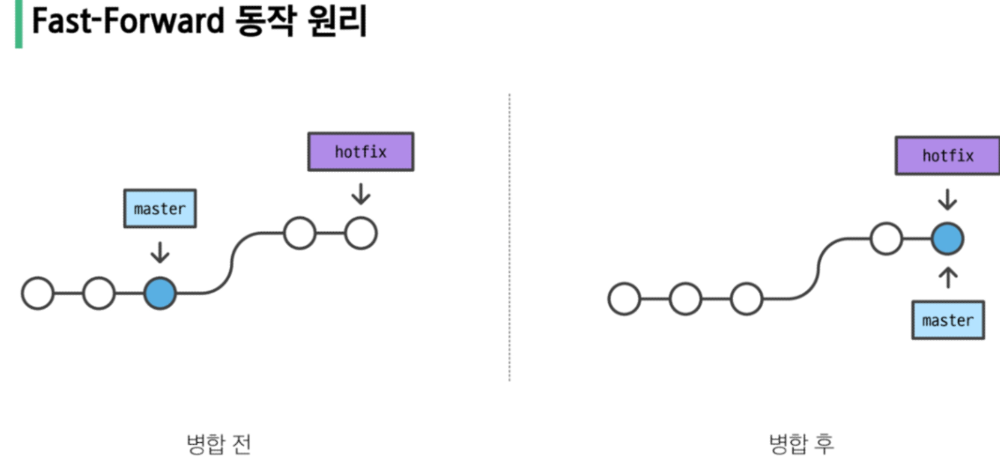

## Branch

- 나뭇가지처럼 여러 갈래로 작업 공간을 나누어 **독립적으로** 작업할 수 있도록 도와주는 git의 도구 ()
- 하나의 작업은 하나의 브랜치로 나누어서 독립된 개발 환경에서 진행되므로 원본에 대해 안전하고, 체계적으로 협업과 개발이 가능하다
- 손쉽게 브랜치를 생성하고 브랜치 사이를 이동할 수 있음

### Branch Command

- `git branch` : 브랜치 목록 확인
- `git branch -r` : 원격 저장소의 브랜치 목록 확인
- `git branch -c <브랜치 이름>` : 새로운 브랜치 생성
- `git branch -d <브랜치 이름>` : 브랜치 삭제 (병합된 브랜치만 삭제 가능)
    - branch 역할 끝났으면 삭제하는 습관 들이기
- `git branch -D <브랜치 이름>` : 브랜치 삭제 (강제 삭제)
- `git swtich <다른 브랜치 이름>` : 다른 브랜치로 HEAD 이동시킴
    - `git switch` 하기 전에, working directory에 있는 파일이 모두 버전 관리가 되고 있는지 **반드시** 확인
        - 버전 관리 의미 : `git add` 를 하지 않은 상태로 switch 하면, 이전 브랜치에서 생성한 파일이 이동한 브랜치에도 존재하게 됨
- ↓ commit을 하면 HEAD가 새로 commit한 파일로 넘어가고, 이 때 이전에 생성한 branch는 같이 넘어가지 않고 해당 commit에 남아있음
    - 아래 상황에서 login으로 브랜치를 switch하면, head가 master-3로 넘어가므로 master-4에 작성한 텍스트는 **다시 사라지고,** master-3까지 작성된 텍스트만 나타남


- Git Branch 정리
    - 브랜치의 이동은 HEAD가 특정 브랜치를 가리킨다는 것
    - 브랜치는 가장 최신 commit을 가리키므로 HEAD가 해당 브랜치의 가장 최신 commit을 가리킴
        - 즉, working directory의 내용도 HEAD가 가리키는 브랜치의 가장 최신 commit 상태로 변함
            - 위에서 login으로 브랜치를 switch 했을 때, master-4에서 추가된 텍스트가 사라지듯이.

## Git Merge

merge 명령어 : `git merge <병합시키고자 하는 브랜치 이름>`

- 병합 전 준비사항
    - 수신 브랜치(병합 브랜치를 가져와서 합치고자 하는 브랜치) 확인하기
        - git branch 명령어를 통해 HEAD가 올바른 수신 브랜치를 가리키는지 확인
        - 병합 진행 위치는 반드시 수신 브랜치에서 진행되어야 함
    - 최신 commit인지 상태 확인하기
        - 수신 브랜치와 병합 브랜치 모두 최신 상태인지 확인(브랜치끼리 병합하는 것!)
- 병합 했으면 쓸데없는 브랜치 지우는거 습관화 하기




### Merge Conflict

뜻 : 병합하려는 두 브랜치가 ‘동일한 파일의 동일한 부분’에서 변경된 후 병합 시 충돌이 발생하는 것

- 충돌 해결 과정
    1. 충돌하는 부분을 확인한 후에는 원하는 대로 충돌 내용을 수정
    2. 병합을 완료할 준비가 되면 충돌하는 파일에서 git add 명령을 실행
    3. 이후 git commit을 실행하여 merge된 commit을 생성
        1. 병합 충돌은 3-Way-Merge 인 경우에만 발생

## Git workflow

뜻 : 원격 저장소를 활용해 다른 사용자와 협업하는 방법

1. 원격 저장소(gitlab) 사용자들과 공유
2. 각 사용자는 clone을 통해 저장소를 로컬에 복제
3. 각자 기능 추가를 위해 수정이 필요하므로 branch 생성 및 거기에 기능 구현
4. 기능을 구현한 후, `git push origin <브랜치 이름>` 을 통해 원격 저장소에 브랜치 반영
5. 브랜치를 반영한 후, master에 적용되게끔 팀장에게 pull requet(이건 홈페이지에서)
6. 팀장이 확인 후 merge 하면 master에 병합되고, 반영된 브랜치는 삭제
7. 각 사용자는 생성했던 브랜치에서 원래의 master 브랜치로 switch 
8. master에 병합된 내용(다른 사람의 기능 구현도 추가된)을 git pull로 로컬에 저장
9. 아까 원격 저장소에서 병합 완료된 로컬 브랜치 삭제
10. 새로운 기능 추가를 위해 branch 생성… 위 과정 반복

---

## 실습

- Branch로 협업하는 과정
    - 예시
        1. 각자 개인 브랜치에서 커밋을 최소 3개 이상 생성한다.
            1. 브랜치 생성 코드 : `git branch -c <브랜치 이름>`
            2. Head를 master에서 생성한 브랜치로 변경 코드 : `git switch <브랜치 이름>`
            3. 커밋할 파일 생성 : `touch <파일명>`
            4. 커밋할 파일 add : `git add <파일명>` 
                1. 수정사항을 커밋할 때, add도 항상 같이 반복해줘야 함
            5. 커밋 : `git commit -m <이름>`
        2. 원격 저장소에 push 한다.
            1. `git push origin <브랜치 이름>`
        3. merge request 생성한다.
            1. gitlab 홈페이지에서 <브랜치 이름> 에서 <master>에게 병합 요청
        4. master에 merge 한다.
            1. 팀장이 merge
            2. merge할 때 여러 명이 동일한 줄을 수정하면 merge block됨 (conflict)
        5. local에서 master에서 pull 받는다.
            1. master로 switch : `git switch <master>`
            2. 이후에 `git pull`
        6. 개인 branch 삭제한다
            1. `git branch -d <브랜치 이름>`

---

```markdown
## git 정리
.git이 중첩되면 안됨!

- git init 
- 내가 push하고자 하는 폴더의 경로로 설정된 상태에서 git init하기
  - 그러고 나서 push하면, 해당 폴더(하위 폴더 포함)가 push됨 

- git push 과정
    - 집에서 git pull이 아니라 clone으로 가져오는 경우
        - git clone으로 github의 파일 가져오기
        - 해당 파일에 집에서 필기나 파일 추가
        - 해당 파일의 경로에서 add commit push

- push가 안되는 경우 점검 사항
  - 우선 pull 먼저 하고 push 해보기
  - 현재 나의 경로 점검
  - `git status`, `git remote -v` 점검
  - `git pull --rebase` 후 push.
  - 내 컴퓨터 ~/Desktop/TIL 경로가 Git 저장소 루트 맞아야 하나?	-> ✅ 맞아야 해. 그래야 저장소 전체를 pull/push할 수 있어
    - 저장소 루트 확인 방법 : `git rev-parse --show-toplevel`

- 원래 나의 파일에, 강사님의 파일을 **복붙**으로 옮기고 그 파일을 업로드(push) 하자
  - 강사님의 파일을 업로드 할 권한은 없음 + 강사님 파일을 수정할 권한도 없음 -> 강사님 파일을 내 파일로 복붙하고, 내 파일에서 수정 진행하기

- vim발생 -> `:q`

- push는 안되고, pull은 되는 경우도 존재
  - push는 원격 저장소에 미는거, pull은 원격 저장소에서 내 로컬 저장소로 가져오는 것
```


```markdown
## 오답노트
- 오류 상황
    - 강의실 컴퓨터에서 작업 → GitHub에 push
    - 집에서 clone → 추가 작업 → git push --force로 GitHub 덮어쓰기
    - 오늘 강의실에서 git pull 시 fatal: refusing to merge unrelated histories 오류 발생
        - 집에서 `--force push`로 기존 github 히스토리를 강제로 덮어써서 로컬 저장소와 원격 저장소의 커밋 히스토리가 달라져서 생긴 오류
    - 해결 방법1 : 강의실 작업 버리기 (덮어쓰기)
        - git fetch --all
        - git reset --hard origin/master
    - 해결 방법2 : 강의실 작업도 살리고 병합하기
        - git pull origin master --allow-unrelated-histories
            - 위 코드에서 충돌이 발생한 경우
                - git add .
                - git commit
                - git push origin master
```                


