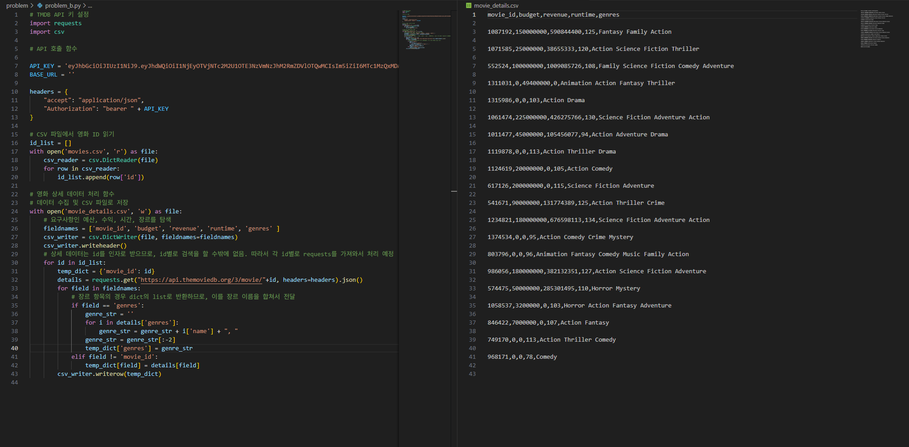
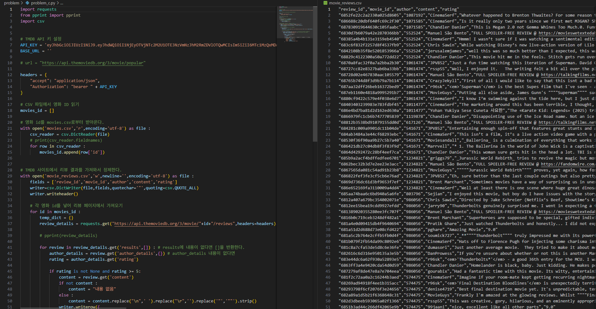
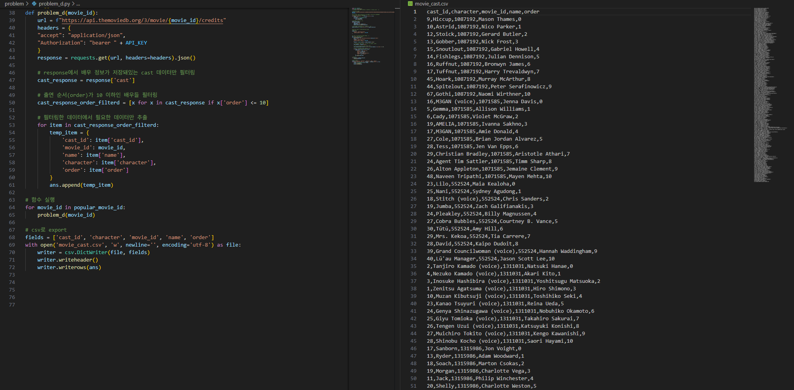
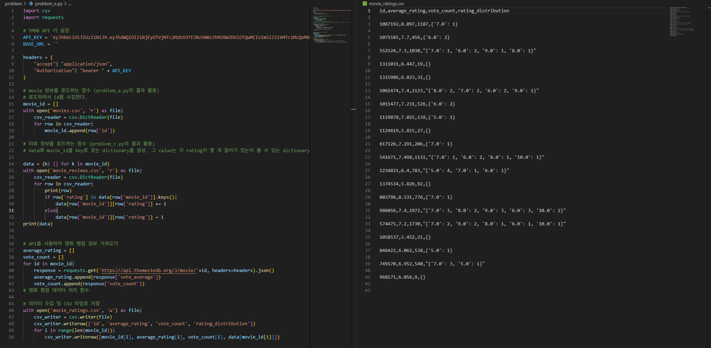

# 01-pjt

## Problem A

### 구현 과정
1. TMDB에서 API key를 받고 header 설정 후 requests 모듈을 통해 popular movie 데이터를 가져옴
2. 최종 답은 빈 리스트로 설정하고, for문과 딕셔너리를 활용해 필요한 정보(id, title, release_date, popularity)를 temp_item 딕셔너리에 입력하고, 최종 답 리스트에 append
3. with을 통해 답을 CSV로 Export

### 학습한 내용(새로 배운 것)
- API Key를 발급하여 데이터를 불러오는 방법
- with을 통한 csv export 실습

### 어려웠던 부분
- API로 데이터를 불러오는 것이 처음이라 어려웠음
- 요구하는 데이터 파일을 TMDB 페이지에서 찾는 과정   

### 결과

## Problem B
   
### 구현 과정
   
detail 항목은 각 영화의 id값을 받으면 그 영화의 자세한 정보를 주게 api가 세팅되어 있음.   
따라서 대상이 되는 영화를 하나씩 api를 가져와 그 데이터를 넣는 방법으로 접근함.   
각 request에 대한 response에 대하여 원하는 값을 바로 csv 파일에 작성하는 방식으로 진행함.   
   
### 학습한 내용(새로 배운 것)
   
1. python은 json 데이터를 dictionary로 읽음.
2. api에 따라 데이터를 전체적으로 줄 수도 있고, id를 구분지을 수도 있음.
3. 그렇기 때문에 공식 api 문서가 매우 중요함. 공식 api가 데이터를 제공해주는 방식을 따라야 함.

### 어려웠던 부분
   
데이터 확인을 위하여 excel로 파일을 열었더니 파일이 깨지는 현상을 관찰. 이에 따라 column에서 문제가 생기는 현상이 발생함.   
이에 다른 환경에서도 동일한 문제가 생기는지를 확인하고, 현재 python 내에서 문제가 발생하지 않는다는 것을 확인함. 현재는 이를 액셀 프로그램 내의 문제로 생각하고 있음.
   
   
### 결과

   

## Problem C
###  학습한 내용
이미 csv로 만들어진 데이터를 읽어서 또 다른 페이지에서 여러번 데이터를 가져오는 부분을 학습했음.
### 어려웠던 부분
영화 ID 별로 리뷰를 가져오는 부분, 중첩된 딕셔너리에서 원하는 정보를 추출하는 부분 등이 어려웠음.

GITLAB에서 CSV 결과를 리뷰하거나 실제 코드에서 CSV를 읽어드릴때에는 문제가 없지만 CSV로 출력했을 때만 글자가 깨진다거나(UTF-8임에도 불구), 콤마 같은 구분자로 제대로 보이지 않는등의 문제가 있어서 어려웠음

### 새로 배운 것 및 느낀점
실제 전처리 과정이 이보다 더 복잡할 수 있다고 생각했을때, 세부적인 내용 (즉, 콤마나 구분자 등)을 효과적으로 처리했을 때 보다 더 좋은 데이터 전처리가 가능하다고 생각함.
Requests를 한번만 보내는 것이 아닌 movie_id 별로 Requests를 따로 보내서 받아오는 부분을 새로 배웠음.
   

### 결과

## Problem D

### 구현 과정
1. with을 통해 기존 problem_a에서 export한 movie.csv 파일을 읽어옴
2. 필요한 정보인 movie_id만 추출하여 popular_movie_id에 저장
3. comprehension을 통해 {'id':num}으로 되어 있는 popular_movie_id를 num만 있는 리스트로 저장
4. 필요한 데이터가 있는 'credit' API 파일을 불러옴
5. 최종 답을 넣을 빈 리스트 미리 설정
6. movie_id를 인자로 받는 함수 생성
- 배우 정보가 저장되어 있는 'cast'만 가져오고, comprehension(`[x for x in cast_response if x['order'] <= 10]`을 통해 출연 횟수가 10 이하인 배우만 필터링
- for문과 딕셔너리를 통해 해당 데이터에서 필요한 데이터('cast_id', 'movie_id', 'name', 'character','order')를 temp_item에 입력하고 이를 최종 답에 append
7. 함수 실행
8. csv로 export

### 학습한 내용(새로 배운 것)
- 딕셔너리 데이터를 가져와서 전처리하는 과정에 대해 익숙해짐
- comprehension에 대한 이해 향상
- 함수 생성 및 적용에 대한 이해 향상

### 어려웠던 부분
- 복잡한 딕셔너리 데이터를 분석하고 원하는 데이터만 추출하는 과정이 어려웠음
- 함수를 정의하는 과정이 어려웠음

   
   
### 결과

## Problem E
   
### 구현 과정
   
조건 상 api와 기존 csv 파일에서 데이터를 읽어들여서 처리해야 하는 방식임.   
이 때 csv에서 읽은 내용에서 개수를 세야 하는 내용이 포함됨.   
이를 구현할 때 movie_id를 기준으로 개수를 세어도 그 안에서 파일 줄마다 movie_id가 일치하는지 확인해야 해 시간이 오래 걸릴 것으로 판단함.   
이에 따라 이 데이터를 dictionary에 저장한 후 불러오는 방식을 선택함.   
이 파트를 이렇게 진행함에 따라 다른 데이터도 리스트에 저장한 후 값을 나중에 한 줄씩 불러오는 방식을 선택하고, 그에 맞게 함수도 선택하였음.   
   
### 학습한 내용(새로 배운 것)
   
1. 프로그래밍하는 과정에서 데이터 구조가 상당히 복잡해지는 과정을 목격함.
2. 이에 따라 나 자신은 이해하지만 남이 이해하기 어려운 코드가 생성됨.
3. 이를 설명하는 주석과 readme가 굉장히 중요하다는 점을 느낌.
   
### 어려웠던 부분
   
`data[row['movie_id']][row['rating']]` 부분이 어느 위치가 어느 것을 지정해야 하는지 생각하는 것이 조금 어려웠음.   
그러나 파일 구조를 생각해보면 처리하는 방식이 정해져 있었기에 원하는 데이터를 정상적으로 접근해서 조작할 수 있었음.
지금 내가 할 수 있는 접근법 중 이 방식이 시간적으로 효율적인 모습으로 보이나, 만약 시간보다 메모리가 더 중요한 상황이라면 코드를 다르게 짜는 것이 나아보임.
   
   
### 결과
