# Xcom과 Variable
- Xcom이란?
  - Cross-Communication의 약자로, Airflow에서 Task 간 데이터를 주고 받기 위한 기능
  - **DAG Run 내에서만 존재**하며, 다른 DAG Run과는 공유되지 않음
  - DatFrame과 같은 **대용량 데이터는 지원하지 않으며**, 주로 문자열, 숫자 등 작은 크기의 데이터를 공유함
  - PythonOperator를 사용할 경우, 해당 함수의 return 값이 자동으로 Xcom에 등록(별도의 처리 없이, Task 간 데이터 전달)됨

- Xcom 데이터 저장(xcom_push)
  - Task 실행 중 데이터를 저장할 때 사용
  - `task_instance.xcom_push(key, value)`를 사용하여 특정 키로 값 저장
  - Key-Value 형식으로 저장됨

- Xcom 데이터 조회(xcom_pull)
  - Task 실행 시 이전 Task에서 저장한 데이터를 가져올 때 사용
  - `task_instance.xcom_pull(task_ids, key)`를 사용하여 특정 Task의 데이터를 가져옴

- Xcom 사용 방법
  - PythonOperator Return 값을 이용한 Xcom
  - push-pull을 이용한 Xcom(위의 데이터 저장, 조회 참고)
  - Jinja template을 이용한 Xcom
  - @task 데코레이터 사용 시 반환값으로 자동 Xcom 저장 

- PythonOperator with Xcom

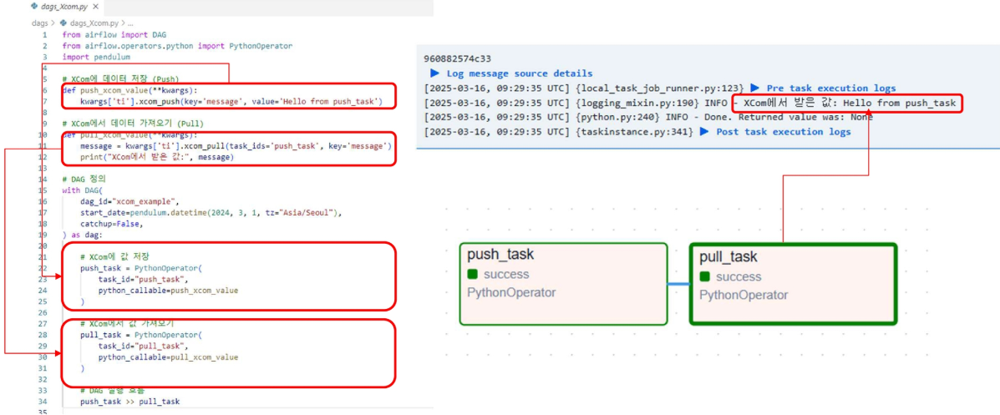

- BashOperator with Xcom(Jinja template 활용)

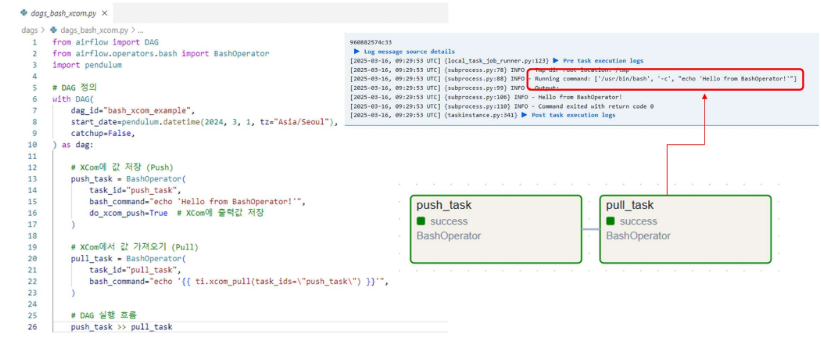

- Python&BashOperator with Xcom

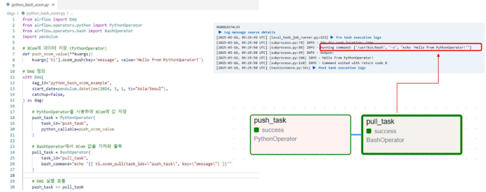

---
- 전역 공유 변수란?
  - Airflow에서 여러 DAG 및 Task 간에 데이터를 공유하기 위한 변수
  - 모든 DAG가 공유할 수 있음 
  - Variable에 등록한 key, value는 메타 데이터베이스에 저장
  - 변수 값은 Airflow UI, CLI, API를 통해 관리 가능

- 전역 공유 변수 등록하기 in UI

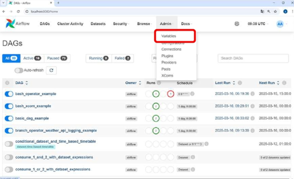 -> 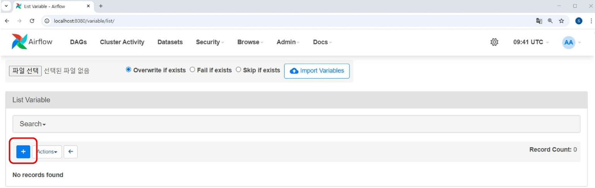 -> 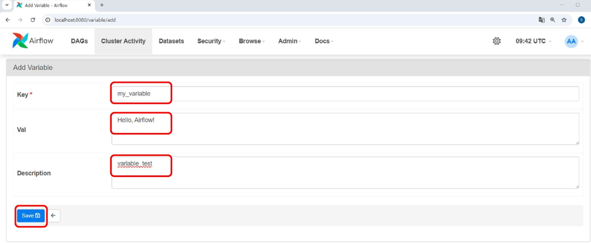

- 전역 공유 변수 사용하기
  - Variable 라이브러리의 get 함수를 사용하여 값 사용
  - `var = Variable.get("key", default_var="default")`
---
- 전역 공유 변수 vs Xcom
  - DAG 실행 단위로 데이터를 유지하고 싶으면 Xcom
  - 여러 DAG에서 공통으로 사용할 데이터는 Variable 사용

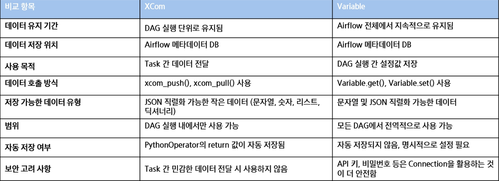

# Branching과 Trigger Rule
- BranchOperator란?
  - Airflow에서 DAG 실행 흐름을 조건에 따라 분기할 수 있도록 하는 오퍼레이터
  - 특정 조건을 평가하여 어떤 Task를 실행할지 동적으로 결정
  - 선택되지 않은 Task는 자동으로 Skipped 상태가 됨

- BranchPythonOperator
  - Python 함수를 사용하여 실행 Task 결정
- BranchDagRunOperator
  - 다른 DAG 실행 여부를 기준으로 분기 처리하는 오퍼레이터 

- 조건 기반 실행 흐름

  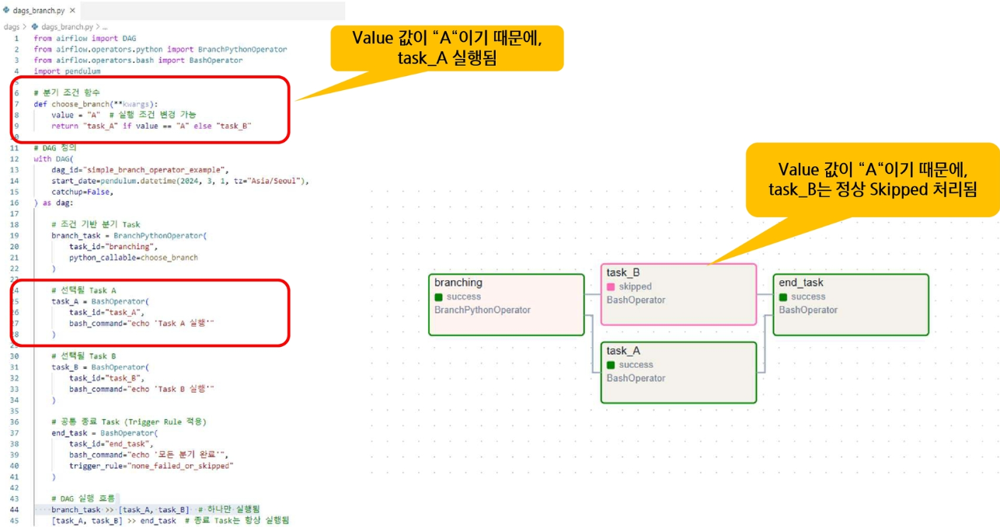

- API 응답값 기반으로 분기 처리 방식

  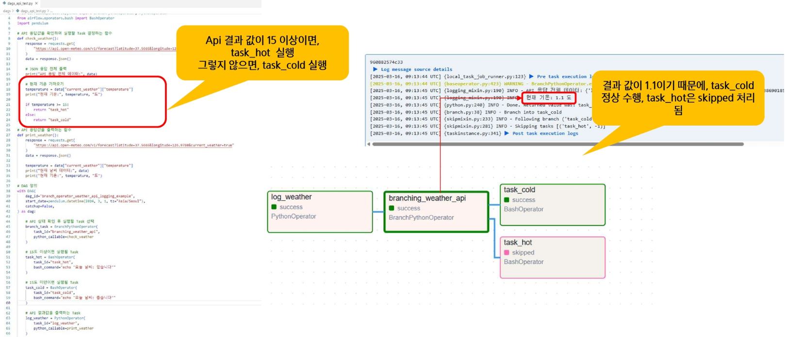

---
- Trigger Rule
  - Task가 실행되기 위한 조건을 설정하는 기능
  - 기본적으로 모든 Upstream Task가 성공해야 실행됨
  - 특정 Task의 실행 결과에 따라 실행 조건을 다르게 설정할 수 있음 

  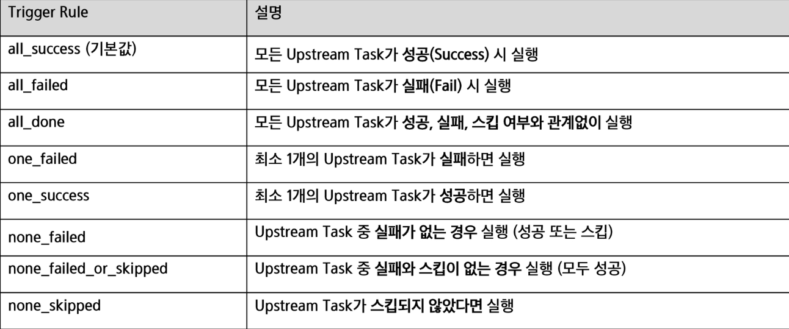

# External Task Sensor
- Task Group이란?
  - DAG 내에서 여러 Task를 그룹화하여 논리적으로 관리하는 기능
  - DAG의 복잡성을 줄이고, 비슷한 작업을 하나의 그룹으로 묶어 가독성 및 유지보수성 향상
  - UI에서 그룹별로 Task를 시각적으로 확인 가능 

  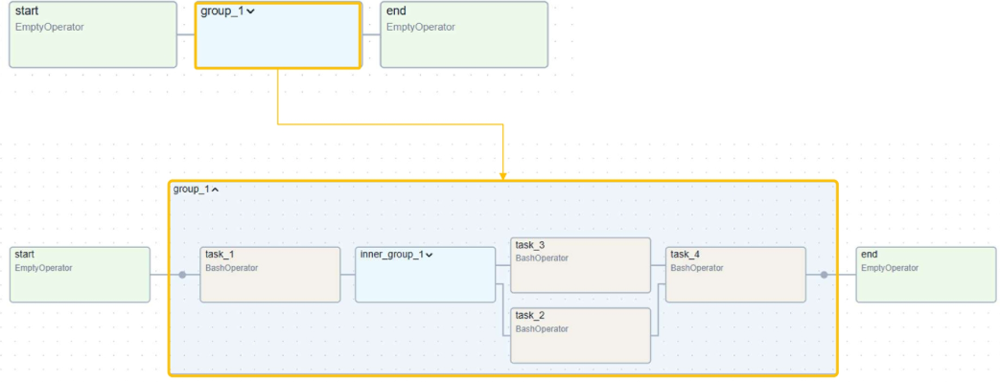

- Task Group 활용법 

  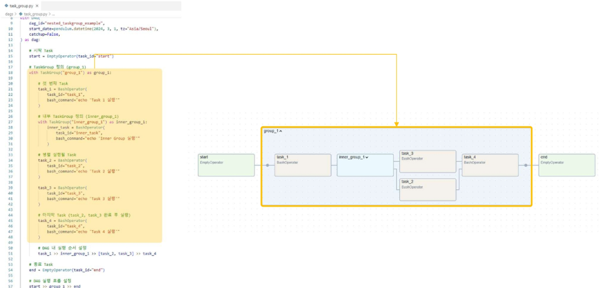

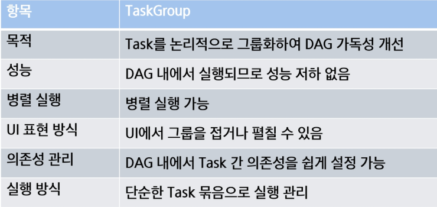
---
- ExternalTaskSensor
  - 다른 DAG의 특정 Task가 완료될 때까지 기다리는 센서 오퍼레이터 
  - **DAG간 의존성을 설정**하여 한 DAG가 실행되기 전에 외부 DAG(TASK)의 실행 완료를 감지
  - 예) DAG A(데이터 적재) -> DAG B(데이터 분석) 

- ExternalTaskSensor 활용법
  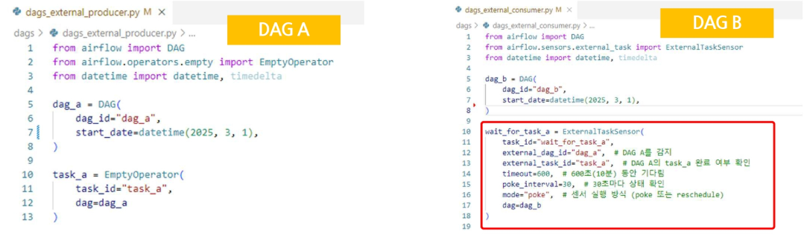
  - DAG B는 DAG A의 task_a가 완료될 때까지 기다렸다가 수행

- Dynamic DAG란?
  - DAG를 정적으로 정의하는 것이 아니라, 실행 시점에 동적으로 생성하는 방식 
  - 여러 개의 비슷한 DAG를 하나의 Python 스크립트에서 생성하여 관리할 수 있음 

  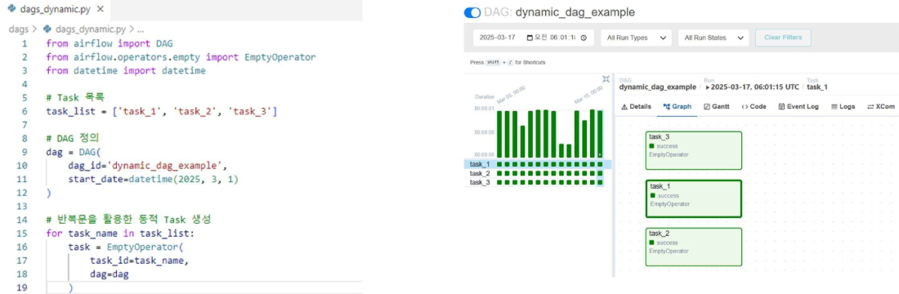

# Airflow Connections 및 Hooks 소개
- Connection
  - Airflow가 외부 시스템(DB, API, 클라우드 서비스 등)과 연결할 수 있도록 설정 
  - Web UI 또는 환경변수를 통해 관리 가능 
- Hook
  - Connection을 사용하여 실제 데이터를 전송하거나, 외부 시스템과 상호작용하는 역할
  - Operator에서 Hook을 활용하여 작업 수행 

    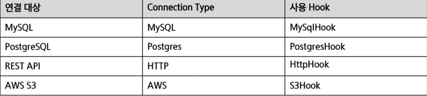

  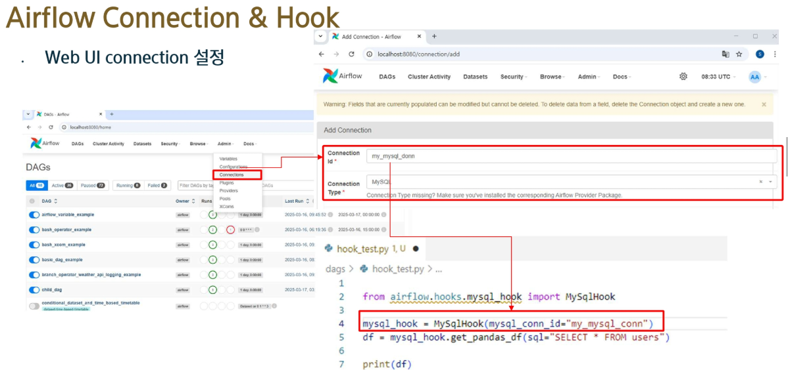

  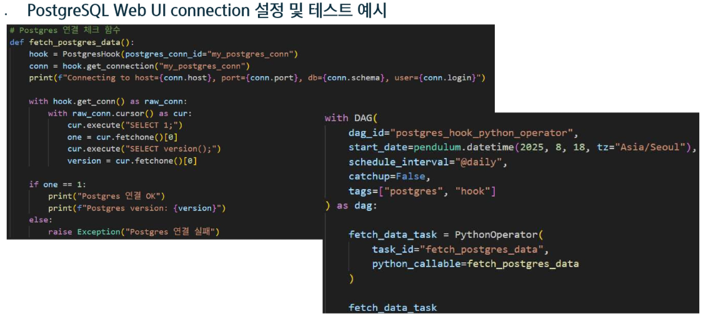

