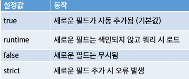
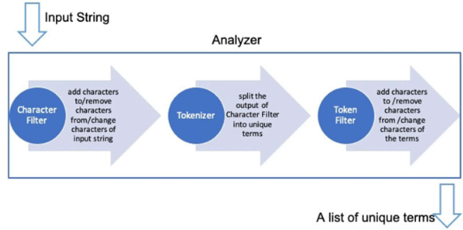

# Mapping
### Elasticsearch Mapping
- Mapping
  - 관계형 데이터베이스의 스키마와 유사한 개념
  - Elasticsearch에서 문서의 필드 유형과 속성을 정의
- 동적 매핑
  - 매핑을 명시적으로 설정하지 않아도 Elasticsearch가 자동으로 생성
  - 편리하지만, 잘못된 데이터 타입 할당 가능성이 있음
- 정적 매핑
  - 사전에 명확하게 매핑을 정의하여 정확한 데이터 타입을 설정
  - 검색 성능 최적화 및 불필요한 리소스 낭비 방지 가능 

### 동적 매핑
- Elasticsearch에서 문서를 색인할 때 필드 이름과 데이터 유형을 **자동으로 결정**하는 기능 
- 자동 매핑
  - 사전 정의 없이도 문서를 색인하면 데이터 유형이 결정
- 규칙 설정 가능
  - 동적 필드 매핑 규칙을 사용하여 원하는 방식으로 동작하도록 설정 가능
    - 파라미터: `es.indices.create(index='products', body={'mappings': {**'dynamic': 'runtime'**}})`
      
      

- 데이터 유형 결정
  - 새로운 필드가 감지되면 해당 필드의 데이터 유형을 자동으로 판단하여 매핑
- 오류 가능성
  - 자동으로 할당된 데이터 유형이 잘못될 경우 검색 오류 발생 가능
- 파라미터 설정 가능
  - 동적 매핑을 활성화하거나 비활성화하는 설정을 조정 가능 

### 정적 매핑
- 문서에 저장될 데이터의 필드와 타입을 사전에 정의하는 방식
- 인덱스 생성 시점에 필드 타입을 미리 지정해야 하며, 한 번 설정된 매핑은 일부 변경이 제한 
  ``` python
  "mappings": {
          "properties": {
              "name": {"type": "text"},
              "brand": { "type": "keyword" },
              "price": { "type": "float" },
              "category": {"type": "text"},
              "rating": { "type": "float" }
          }
      }
  ```    

### Elasticsearch 필드 데이터 타입
- 지형 데이터 타입(위치, 지도데이터 검색 및 분석)
  - geo_point(위도, 경도), geo_shape(복잡한 지형 정보)
- 계층 구조 데이터 타입
  - Object, Nested
- **일반 데이터 타입**
  - 문자열 데이터 타입: keyword, text
    - text: 전문(full-text) 검색을 위한 분석(토큰화)이 적용된 문자열
    - keyword: 정렬 및 필터링에 최적화된 문자열
  - date,
  - long, double, integer
  - boolean, 


# Index
### Forward Index vs Inverted Index
- Forward Index
  - **문서 중심으로** 인덱스를 구축 
  - 각 문서가 포함하는 단어 목록을 저장
  - 인덱스 구축이 단순하지만, 검색 속도가 느림 (모든 문서를 순회해야 함)
  - 특정 문서의 내용을 확인할 때 유용 
  - 문서1: 단어1, 단어2, 단어3, ...
- Inverted Index
  - **단어 중심으로** 인덱스를 구축
  - 각 단어가 포함된 문서 목록을 저장
  - Elasticsearch에서 기본적으로 사용하는 방식
  - 검색 시 특정 단어를 빠르게 찾을 수 있음 
  - 단어1: 문서1, 문서2, 문서3 ,.. 


# Analyzer
### Analyzer(분석기) = tokenzier + filter
- Analyzer는 문서를 색인하고 검색할 때 텍스트를 처리하는 방식 
- 문서의 내용을 토큰으로 변환하여 색인 및 검색 
- 어떤 Analyzer를 사용할지와 실행 순서를 정하는 것이 중요 

### 색인과 검색에서의 Analyzer의 차이
- 일반적으로 색인과 검색 시 같은 tokenzier를 사용하는 것이 좋음
- 색인과 검색에 다른 분석기를 적용하는 경우
  - 검색어 필터링이 필요한 경우
    - 검색어에서 의미 없는 단어를 제거해야 하는 경우
    - 특정 단어를 제외하고 검색해야 하는 경우
  - 동의어나 맞춤법 교정을 적용하는 경우
    - car를 검색하면 automobile도 검색되도록 설정
    - color와 colour를 동일하게 처리 

### Analyzer 구성요소


- Character Filters(전처리)
  - 원본 텍스트를 전처리하는 단계
  - 특정 문자나 패턴을 변환하거나 제거함 
  - 여러 개를 배열로 사용 가능 
    - html_strip -> HTML 태그 제거
    - mapping -> 특정 문자열을 다른 문자열로 매핑
    - pattern_replace -> 정규식을 이용한 텍스트 변경 
- Tokenizer
  - Character Filter를 거친 텍스트를 특정 규칙에 따라 토큰으로 분리
  - 한 개의 Tokenizer만 사용 가능
    - whitespace -> 공백 기준으로 단어 분리
    - standard -> 일반적인 텍스트 토큰화
    - ngram -> 부분 문자열 단위로 분리 (english -> en, ng, gl, li, is, sh)
- Token Filters(후처리)
  - Tokenizer를 통해 분리된 토큰을 추가, 수정, 삭제하는 필터
  - 여러 개를 배열로 사용 가능 
    - lowercase -> 소문자 변환
    - stop -> 불용어(the, is, ..) 제거
    - synonym -> 동의어 처리 (예: car <-> automobile)


### _analyze API
- 커스텀 분석기를 테스트할 수 있도록 제공되는 API 
  ``` python
  response = es.indices.analyze(body={
    "char_filter": ["html_strip"],
    "tokenizer": "whitespace",
    "filter": ["stop", "lowercase"],
    "text": ["<b>삼성 갤럭시</b> S25 Ultra"]
  })
  ```

### Analyzer 조합(커스텀 분석기)
- custom analyzer를 생성할 때 여러 가지 요소를 조합 가능
- tokenzier는 하나만 지정할 수 있으며, char_filter와 filter는 여러 개 적용 가능 
  ``` python
  response = es.indices.analyze(body={
    'char_filter': ['html_strip'],
    'tokenizer': 'whitespace',
    'filter': ['stop', 'lowercase'],
    'text': ['삼성 갤럭시 S25 Ultra']
  })
  ```

### 한국어 Analyzer(Nori Analyzer)
- nori 분석기 특징
  - 형태소 기반 분석기로, 한국어의 복잡한 문장 구조를 효과적으로 분석 
  - Elasticsearch 기본 패키지가 아니므로 설치 필요 
- nori 분석기 구성요소
  - Tokenizer
  - nori_tokenizer -> 형태소 분석을 수행하여 단어를 분리 
- Token Filters
  - nori_part_of_speech -> 품사 기반 필터링(예: 명사만 남기기)
  - nori_readingform -> 한자/외래어 등을 한글 발음으로 변환
  - nori_number -> 숫자를 표준화(예: 일등 -> 1등)

### Nori Tokenizer
- 한국어 형태소 분석기
- 형태소 분석을 지원하지 않는 기본 분석기 사용 시 복합명사를 적절히 분해할 수 없음 

### 동의어 처리
- 색인 시 동의어 처리와 검색 시 동의어 처리 두 가지 방식 가능
- 색인 시 동의어 처리
  - 색인 시점에서 동의어를 확장하여 저장하는 방식
  ``` python
  'synonym_filter': {
    'type': 'synonym',
    'synonyms': [
      'notebook', 'laptop', 'smartphone'
    ]
  }
  ```
- 검색 시 동의어 처리
  - 검색 시점에서 동의어를 확장하여 질의하는 방식 
  ``` python
  'mappings': {
    'properites': {
      'description': {
        'type': text',
        'analyzer': 'standard',
        'search_analyzer': 'synonym_analyzer'
      }
    }
  }
  ```

### 동의어 사전 구성
- 단어 동등 관계 (A, B)
  - A와 B를 동일한 의미로 저장
- 단어 치환 관계 (A -> B)
  - A를 B로 변환

### 동의어 사전 불러오기
- 동의어 사전 저장 위치
  - Elasticsearch 노드의 config 폴더 하위에 동의어 사전을 생성 