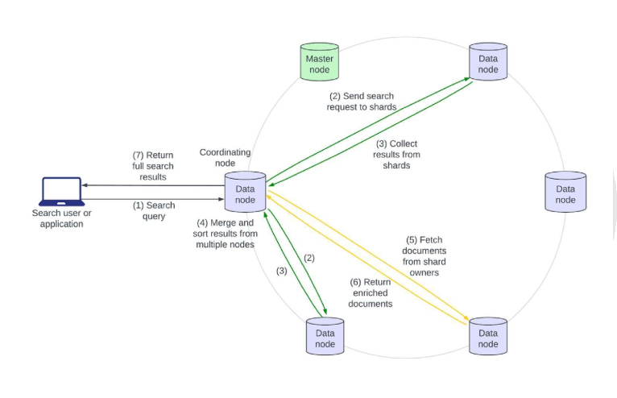
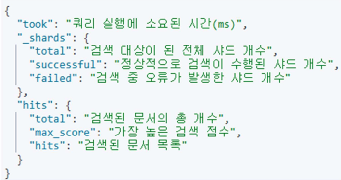
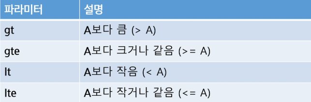
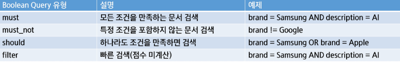

# Elasticsearch의 검색 방법
### Elasticsearch의 검색
- 클라이언트가 클러스터 내 아무 노드에 검색 요청(GET) 전송
- 해당 노드는 Coordinate Node(요청 분배)로 동작
- 쿼리를 모든 샤드(Primary 또는 Replica 중 하나)에 전달
- 샤드별로 검색 실행 -> 결과를 Coordinate Node에 다시 전달
- Coordinate Node는 결과를 취합, 정렬, 필터링 등 후처리
- 최종 결과를 클라이언트에게 응답
  

### URI 검색
- 간단한 검색을 수행할 떄 URI 검색을 사용
- 'key=value' 형식으로 전달
- URL에 검색할 컬럼과 검색어를 지정 가능하며 검색 조건을 추가할 수 있음
- Request Body 검색 대비 단순하고 사용이 편리하지만 복잡한 쿼리를 수행할 수 없다는 한계
- 예: `GET /products/_search?q=brand:Samsung&default_operation=AND` -> products 인덱스에서 brand 필드가 Samsung인 모든 문서를 AND 연산 기준으로 검색하라

### Query DSL
- Elasticsearch에서 검색을 수행하기 위한 JSON 기반의 질의 언어
- JSON 형식 사용
  - HTTP 요청 시 본문의 JSON 문서를 활용하여 Elasticsearch에 검색 요청
- Query Context
  - 검색어와 문서 간의 유사도 점수(_score)를 기반으로 검색 스코어링을 통해 문서의 중요도를 평가
- Filter Context
  - 문서가 검색 조건에 해당하는지 여부만 판단(유사도 점수 계산 X)
  - 캐싱이 가능하여 성능 최적화 가능 
    - 캐싱 : 한 번 계산한 필터 결과를 저장해 두었다가, 다음 검색에서 그대로 재사용하는 것

### Query DSL 쿼리 형식


- Query DSL 쿼리 결과
  

### 검색 결과 정렬
- 기본 정렬
  - _score: 기본적으로 score 값(유사도 점수)에 따라 검색 결과가 정렬
  - _score값이 높은 문서일수록 쿼리와 더 높은 유사도를 가지므로 상위에 노출됨
  - _score 값은 TF-IDF 또는 BM25 등의 알고리즘을 기반을 ㅗ계싼
- 특정 필드를 기준으로 정렬
  - price(가격) 기준 정렬: 최신 제품 또는 가격이 높은 순으로 정렬 가능
  - name(상품명) 기준 정렬: 이름순 정렬 가능
  - created_at(등록일) 기준 정렬: 최신순 또는 오래된 순으로 정렬 가능 
  - 예: `'sort':{'price':{'order':'desc'}}`

### 검색 결과 페이징
- 검색 결과 보여주기
  - from: 페이지를 가져올 때의 시작점
  - size: 검색 결과를 가져올 양 

### 멀티테넌시
- 다중 인덱스 검색의 형태
- 스키마가 달라도 검색이 가능하지만 주로 유사한 경우에 사용

### Filter Context
- Term(단어) level query
  - 텍스트 분석기를 사용하지 않고 **정확한 값**을 검색할 때 사용
  - 필터 되는 속도가 빠름
  - SQL에서 =와 같은 역할 
- Terms level query
  - 다중 값 조회
  - 특정 필드에 대해 SQL의 IN 조건처럼 여러 값을 검색 

### Range Query
- 숫자, 가격, 크기, 날짜 등을 범위로 필터링할 때 사용 
- SQL의 BETWEEN 또는 >=, <=, >, < 조건과 유사한 기능 

  

### Query Context
- Match Query
  - Elasticsearch에서 가장 기본적인 전체 텍스트 검색 방식 
  - 분석기를 적용하여 단어를 토큰화 및 변환한 후 검색
  - SQL로 표현하면 LIKE '%검색어%' 와 비슷한 기능이지만 훨씬 효율적 
- Match Query with operator
  - operator는 검색어가 여러 개일 때 AND 또는 OR 조건을 적용할지 결정 
  - `'query': "Samsung Ultra", "operator": "AND"` -> Samsung 과 Ultra 둘 다 포함한 문서만 반환
- Match Phrase Query
  - 단어 순서를 유지한 채 검색을 수행 
- Match Phrase Query
  - 단어 순서를 유지한 채 검색을 수행하되, 자동완성 형태로 검색 가능
  - `'query': {'match_phrase_prefix': {'name': "Samsung N'}}` -> Samsung Neo가 기억 안나는 경우 N까지만 입력해도 괜찮음 
- Multi Match Query
  - 여러 개의 필드를 동시에 검색할 때 사용하는 쿼리
  - type을 설정하여 검색 방식 조정 가능 (best_fields, most_fields, cross_fields)

### Query String
- Lucene Query Syntax를 사용하여 텍스트를 복합적인 쿼리 구문으로 분석하는 검색 방식
- 기본적인 텍스트 검색, AND, OR, 범위 검색, 정규식 검색 등을 지원 

### Exist Query 
- 특정 필드가 존재하는 문서만 검색
- Elasticsearch는 필드가 존재하는 문서와 존재하지 않는 문서 공존 가능 

### Boolean Query
- 여러 개의 조건을 조합하여 검색을 수행하는 쿼리 방식
- must, must_not, should, filter 네 가지 방식으로 조합 가능 
- SQL의 AND, OR, NOT 연산과 유사함 

  

  ``` python
  query = {
      "_source": ["name", "brand", "description"],
      "query": {
          "bool": {
              "must": [
                  { "match": { "brand": "Samsung" } },
                  { "match": { "description": "AI" } }
              ]
          }
      }
  }
  ```
  ``` python
  query = {
      "_source": ["name", "brand", "description"],
      "query": {
          "bool": {
              "must_not": [
                  { "match": { "brand": "Apple" } }
              ]
          }
      }
  }
  ```

### Nested(중첩) Query
- 중첩된 객체(배열 형태의 JSON 객체)에서 특정 조건을 만족하는 문서를 검색 
- 일반적으로 JSON 객체가 배열로 저장될 때 사용 
- Elasticsearch는 기본적으로 문서를 평탄화(flat)하여 저장 
    ```
  {
    "name": "Galaxy S24",
    "brand": "Samsung",
    "features": [
      { "feature_name": "RAM", "feature_value": "16GB" },
      { "feature_name": "Camera", "feature_value": "200MP" }
    ]
  }
  ```
  ->
  ``` 
  features.feature_name : ["RAM", "Camera"]
  features.feature_value : ["16GB", "200MP"]
  ```
  - nested query를 사용해야만 같은 객체 안에서 RAM = 16GB인지 정확하게 필터링 가능
  - nested query를 쓰지 않으면 “RAM도 있고 16GB도 있네?” 수준에서 매칭 → 엉뚱한 결과
  ```
  query = {
      "query": {
          "nested": {
              "path": "features",
              "query": {
                  "bool": {
                      "must": [
                          { "term": { "features.feature_name": "RAM" }},
                          { "term": { "features.feature_value": "16GB" }}
                      ]
                  }
              }
          }
      }
  }
  ```

# Aggregation
- Elasticsearch에서 데이터를 분석하고 통계를 계산하는 기능 
- 분산된 문서에서 검색 조건에 맞는 데이터만 모아 통계 수행
- SQL의 GROUP BY, COUNT, SUM, AVG 등의 역할을 수행 

### Metric Aggregations
- 개별 필드의 통계 값을 계산
- sum, average, min, max, stats 등의 연산 수행
  ``` python
  query = {
      "size": 0, # 문서 자체는 반환하지 않고 집계 결과만 조회 
      "aggs": {
          "average_price": { # 네이밍
              "avg": {
                  "field": "price"
              }
          }
      }
  }
  ```

### Bucket Aggregations
- 특정 조건에 따라 데이터를 그룹화
- SQL의 GROUP BY와 유사 
  ``` python
  query = {
      "size": 0,
      "aggs": {
          "by_brand": { # 네이밍
              "terms": {
                  "field": "brand",
                  "size": 10
              }
          }
      }
  }
  ```

### 집계와 필터
- 검색 결과에 대한 집계 가능
- 집계만 별도로 수행 가능 
  ``` python
  query = {
      "size": 0,
      "query": {
          "term": {
              "brand": "Samsung"
          }
      },
      "aggs": {
          "price_stats": {
              "stats": {
                  "field": "price"
              }
          }
      }
  }
  # brand 필드의 Samsung 이라는 keyword를 가진 경우만 price의 stats(통계적 정보)를 불러옴
  ```