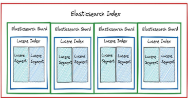

# Elasitcsearch 개요
- 정보 검색이란?
  - 대규모 데이터 속에서 사용자가 원하는 정보를 찾아 제공하는 기술
  - 웹 문서, 이미지, 동영상, 논문 등 다양한 데이터 유형을 대상으로 함
- 정보 검색의 핵심 기술
  - 데이터 수집
    - 웹 크롤링: 웹 문서를 자동으로 수집하여 색인하는 방식
    - 스크래핑: 특정 웹사이트에서 데이터를 추출하여 가공하는 방식
  - 데이터 저장 - 역색인
    - 키워드와 해당 키워드가 포함된 문서 정보를 저장하는 구조
    - 문서 검색 시 키워드를 기반으로 관련 문서를 빠르게 찾아줌
  - 검색 알고리즘
    - TF-IDF: 특정 키워드가 문서 내에서 가지는 상대적 중요도를 평가하는 기법
    - BM25: TF-IDF를 개선한 가중치 기반 검색 알고리즘

- 기존 RDB 검색
  - SQL: `SELECT title FROM product WHERE title LIKE '%삼성 블루투스 이어폰%'`
  - -> 문제점: 쿼리가 복잡해짐 / 성능에 문제 발생 / 스펠링 오류, 유사 검색 불가

- Elasticsearch
  - 강력한 오픈소스 검색 및 분석 엔진
  - 수평적 확장성, 안정성, 쉬운 관리를 위한 설계
  - Apahce Lucene 기반

- Lucene
  - 검색 라이브러리, Elasticsearch의 핵심 검색 기능 담당
  - Java로 작성된 고성능 텍스트 검색 엔진 라이브러리
  - 검색, 색인 기능을 제공
  - 단독으로 사용하려면 직접 애플리케이션 개발 필요 
  -> Elasticsearch는 Lucene을 기반으로 동작하며, REST API 및 분산 환경 지원 

- Lucene의 segment
  - 루씬에서 색인된 문서들을 저장하는 최소 단위
  - 하나의 샤드는 여러 개의 세그먼트로 구성
  - 한 번 생성되면 수정되지 않음
    - 문서가 업데이트 되면 새로운 세그먼트가 생성됨
    - 삭제된 문서는 삭제 플래그로 관리
- 세그먼트의 장점
  - 동시성 확보 : 여러 세그먼트에서 동시에 검색 가능
  - 빠른 색인 처리: 기존 세그먼트를 수정하지 않고 새로운 세그먼트 추가
  - 안정적인 검색: 검색 시 기존 세그먼트는 그대로 유지되므로, 검색 중단 없이 색인 가능 

  

- Elasticsearch 특징
  - 분산 구조
    - 클러스터 내 사용 가능한 모든 노드에 데이터를 자동으로 분산하여 준실시간으로 대량의 데이터를 처리 가능하도록 함
  - 전문 검색
    - 고급 전문 검색 기능을 지원하며, HTTP 웹 인터페이스와 스키마가 없는 JSON 문서를 사용
  - 확장성
    - 수백 대에서 수천 대의 서버로 확장 가능, 구조화된 데이터 및 비정형 데이터 수 페타바이트 규모까지 처리 가능
  - 유연성
    - 다양한 소스로부터의 이질적인 데이터 유형을 색인할 수 있으며, 복잡한 검색 기능 제공 

- Elasticsearch 활용 
  - 기업 검색
  - 로그 수집 및 분석
  - 보안 정보 및 이벤트 관리
  - 데이터 분석
  - 개인화 및 추천 시스템

- Elasticsearch 기본 요소
  - 문서(Document) -> 하나의 JSON 객체
    - Elasticsearch에서 문서는 색인될 수 있는 기본 정보 단위
    - 각 문서는 JSON 형식으로 표현되며, 가벼운 데이터 교환 형식 
  - 필드
    - 필드는 Elasticsearch에서 가장 작은 데이터 단위이며, 하나의 키-값 쌍을 의미 
  
  

- Elasticsearch 데이터 저장 및 관리
  - 인덱싱(테이블에서 데이터를 뽑아내는 것)
    - 데이터를 Index 단위로 관리 
    - 각 인덱스는 Table처럼 동작함
    - 문서는 JSON 형식으로 저장되며, 검색을 위해 최적화된 형태로 변환 
  - 샤딩(쪼개기)
    - Index는 여러 개의 샤드로 나눌 수 있음
  - 레플리카
    - 레플리카 샤드는 기본 샤드의 사본으로, 장애 발생 시 데이터 손실을 방지하고 검색 성능을 향상시키는 역할
    - 여러 복제본이 존재하면 검색 요청을 분산 처리할 수 있어 시스템의 안정성과 확장성이 높아짐 

- Elasticsearch 검색 동작 원리
  - 질의 처리
    - 사용자가 질의를 입력하면, 해당 질의는 구문 분석 및 변환 과정을 거쳐 루씬 인덱스에서 검색이 가능하도록 최적화된 질의 형식으로 변환 
    - 변환된 질의는 모든 관련 샤드(기본 샤드 및 복체 샤드)에 병렬로 실행되어 빠른 검색이 가능 
  - 연관성 점수 계산
    - Elasticsearch는 검색 결과의 연관성을 평가하기 위해 다양한 알고리즘을 활용
    - TF-IDF 및 BM25 등의 알고리즘을 사용하여 각 문서가 사용자의 질의와 부합하는지 계산
    - 해당 점수는 검색 결과의 순위를 결정하는 데 활용 
  - 준실시간 검색
    - 데이터를 검색하면서 동시에 색인할 수 있는 준실시간 검색 기능을 제공 
    - 메모리 버퍼를 활용해 새로운 문서를 저장 
    - 일정 주기로 버퍼를 비워 색인 세그먼트를 생성하여 빠르게 검색 가능 


# Elasticsearch 설치 및 환경 구성
- 문법에 맞게 작성 후 docker-compose를 활용해 환경 띄우기
- Windows는 WSL을 통한 docker desktop 활용
- 사용할 Docker 이미지 : `docker.elastic.co/elasticsearch/elasticsearch:8.17.1`
- container_name: `es01` -> 노드의 이름으로 클러스터 내에서 구분할 때 사용 
  ``` python
  services:
  es01:
    image: docker.elastic.co/elasticsearch/elasticsearch:8.17.1
    container_name: es01
    environment:
      - node.name=es01
      - cluster.name=elastic-docker-cluster

      ## 3개의 노드 실행 시
      # - discovery.seed_hosts=es02,es03
      # - cluster.initial_master_nodes=es01,es02,es03
      
      ## 노드 하나만 실행 시
      - discovery.seed_hosts=es01
      - cluster.initial_master_nodes=es01

      - node.roles=master,data,ingest
      - "ES_JAVA_OPTS=-Xms512m -Xmx512m" # 같은 크기로 맞추는 것 권장 
      - xpack.security.enabled=false
      - network.host=0.0.0.0
  ```


# Elasticsearch REST API & Document CRUD
- RESTful API를 통해 클라이언트와 통신
  - HTTP를 기반으로 동작
  - 자원을 URL로 표현(/users/1, /products/10 등)
  - HTTP 메서드를 활용하여 CRUD 작업 수행(GET, POST, PUT, DELETE)
  - JSON/XML 등 다양한 데이터 형식을 사용(웬만하면 JSON) 

- POST
  ``` python
  from elasticsearch import Elasticsearch

  # 클라이언트 생성
  es = Elasticsearch("http://localhost:9200") 

  # 문서 삽입
  doc = {
      "name": "Samsung Galaxy S24 Ultra",
      "brand": "Samsung",
      "price": 1199.99,
      "category": "smartphone",
      "rating": 4.8
  }

  response = es.index(index="products", id=1001, document=doc)

  # 결과 출력
  print(response)
  ```

- GET
  ``` python
  from elasticsearch import Elasticsearch

  # Elasticsearch 클라이언트 생성
  es = Elasticsearch("http://localhost:9200")

  # 문서 조회 (ID: 1001, 인덱스: products)
  response = es.get(index="products", id=1001)

  # 결과 출력
  print(response)
  ```

- UPDATE
  ``` python
  from elasticsearch import Elasticsearch

  # Elasticsearch 클라이언트 생성
  es = Elasticsearch("http://localhost:9200")

  # 업데이트할 필드 정의
  update_body = {
      "doc": {
          "price": 1099
      }
  }

  # 문서 업데이트 요청 (ID: 1001)
  response = es.update(index="products", id=1001, body=update_body)

  # 결과 출력
  print(response)
  ```

- Elasticsearch 문서 업데이트
  - Elasticsearch의 문서는 불변하므로 직접 수정되지 않으며, 업데이트 시 새로운 문서로 저장 등으로 사용 가능 
  - 업데이트 과정
    - 기존 문서 조회 -> 변경 사항 적용 -> 새 문서 색인(저장) -> 이전 문서 삭제 처리 -> 세그먼트 병합

- DELETE
  - delete 만으로는 실제로 삭제되는 것이 아니고 표시되기 때문에 flush를 해야 완전 삭제 
  ``` python 
  from elasticsearch import Elasticsearch

  es = Elasticsearch("http://localhost:9200")

  # 문서 삭제 (ID: 1001, 인덱스: products)
  response = es.delete(index="products", id=1001)

  print(response)

  # 인덱스 강제 flush
  response = es.indices.flush(index="products")

  print(response)
  ```

- UPSERT(Update or Insert)
  - 해당 ID의 문서가 존재하면 업데이트 수행
  - 해당 ID의 문서가 없으면 새 문서 생성
  ``` python
  from elasticsearch import Elasticsearch

  es = Elasticsearch("http://localhost:9200")

  # 업데이트할 필드 정의
  update_body = {
      "doc": {
          "price": 1099,
          "stock": 150
      },
      "doc_as_upsert": True
  }

  # 문서 업데이트 (또는 없으면 삽입)
  response = es.update(index="products", id=1001, body=update_body)

  print(response)
  ```


