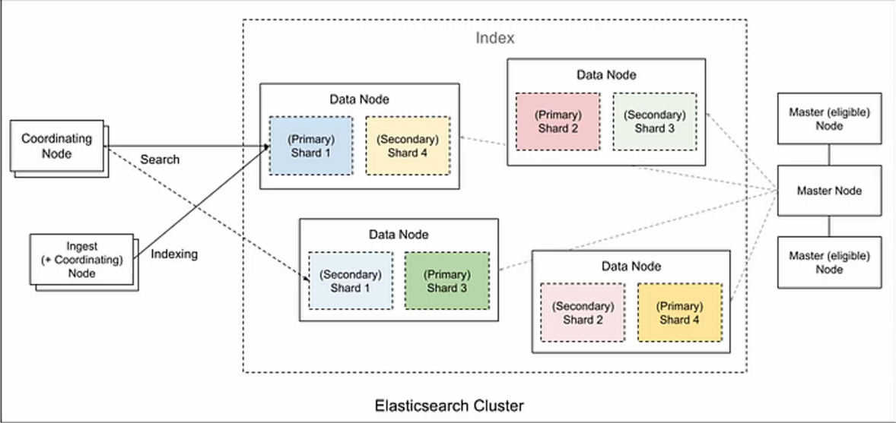
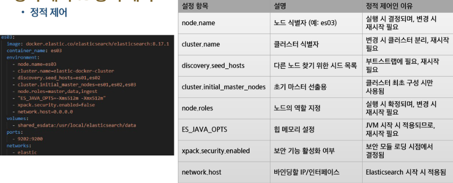

# Elasticsearch의 아키텍처와 분산 처리
- Elasticsearch의 클러스터 및 노드 개념
  - 클러스터
    - 클러스터는 하나 이상의 노드로 구성된 그룹
    - 클러스터는 고유한 이름을 가지며, 데이터를 분산 저장하고 관리하는 역할을 수행
  - 노드
    - Elasticsearch의 개별 실행 인스턴스를 노드라고 함
    - 각 노드는 데이터를 저장하며, 클러스터의 색인 및 검색 기능에 참여 

- 클러스터
  - 분산된 데이터 처리
  - 노드의 역할과 관리 
  - 안정성과 가용성 확보
  - 유연한 확장성과 성능 최적화 

- 노드 유형
  - 마스터 노드
    - 클러스터 전체의 작업을 관리하고, 인덱스 생성/삭제 및 노드 상태 관리 수행
  - 데이터 노드
    - 데이터를 저장하며, CRUD, 검색 및 집계 작업 처리
  - 인제스트 노드
    - 색인 전에 필터링, 변환 및 데이터 정제 작업 수행
  - 코디네이팅 노드
    - 클라이언트 요청을 라우팅하며, 여러 노드에 분산된 검색 로드를 균형 있게 처리 
  - 노드 유형은 4종류이지만, 노드 개수는 원하는 만큼 구성 가능하며, 한 노드에 여러 역할을 동시에 줘도 되고, 따로 분리해도 됨
  

- 샤드
  - Shard
    - 데이터를 나누어 저장하는 작은 단위로, 노드 간 분산 저장을 통해 성능과 확장성 보장
  - Primary Shard
    - 색인 생성 및 CRUD 작업 수행 
    - 처음 인덱스 생성 시점에서 설정한 이후에는 변경이 불가능 
  - Replica Shard
    - 기본 샤드의 복사본으로 장애 복구 및 검색 성능 향상 역할 
    - 개수 변경 언제든지 가능 

- Replication
  - 데이터를 복제하여 중복성을 확보하고, **고가용성** 및 **장애 대응**을 보장
  - 동작 방식
    - Primary-Replica 관계: Primary Shard는 0개 이상의 Replica Shard를 가질 수 있음
    - 쓰기 연산: Primary Shard에서 발생한 변경 사항이 모든 Replica Shard에 복제됨
    - 읽기 연산: Primary와 Replica Shard가 함께 **검색 부하를 분산**하여 성능 향상 
  - 동일한 샤드의 Primary와 Replica를 같은 노드에 저장할 수 없으므로 충분한 노드 필요
    -> 저장 공간 추가 소모 -> 트레이드오프(안정성 증가 but 자원 소모 커짐)
  ``` python
  es.indices.create(
    index='book',
    body={
      'settings': {
        'index': {
          'number_of_shards': 5,
          'number_of_replicas': 1
        }
      }
    }
  )
  ```


# 클러스터 운영 
- 정적 제어 
  - Docker Compose나 elasticsearch.yml에서 설정하는 항목들 
    - 보통 클러스터 구조, 노드의 역할, 네트워크, 보완 관련 설정 
    
    
  - 데이터 경로 설정: 환경 변수 설정을 통해 데이터 및 로그 저장 경로를 설정 

- 동적 제어
  - Elasticsearch 실행 중 REST API(또는 Python 등 클라이언트)로 변경하는 설정
    - 클러스터 또는 인덱스 레벨에서 실시간 변경 가능
    - 운영 중 수정 가능하므로 튜닝이나 장애 대응에 유리 
    - 샤드 할당 설정 

- 데이터 티어링
  - 데이터를 핫, 웜, 콜드 등의 계층으로 나누어 저장하고 관리
  - 사용하는 빈도를 기준으로 클러스터 내 데이터 배포 전략
  - 핫 > 웜 > 콜드 
  -> 비용 절감, 성능 최적화, 데이터 수명주기 관리, 자동화 가능 
  
- 인덱스 alias
  - 인덱스 명을 대신하는 가상의 이름을 부여할 수 있음
  - 여러 개의 인덱스를 하나의 인덱스처럼 연결하여 사용 가능 

- ILM(인덱스 생명주기 관리)
  - 인덱스가 계속해서 쌓이는 환경에서 인덱스를 효율적이며 자동화로 관리할 수 있는 서비스 
  - 인덱스의 생성, 보관, 삭제 등을 자동화하여 시간과 노력을 절약
  - 최신 데이터와 오래된 데이터를 적절한 저장소로 분리하여 시스템 성능 개선