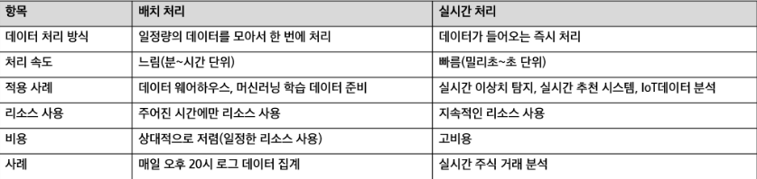
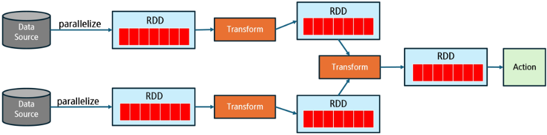
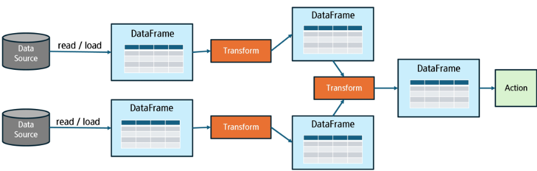
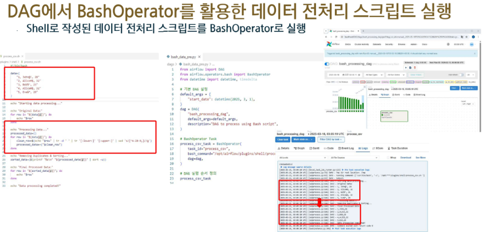
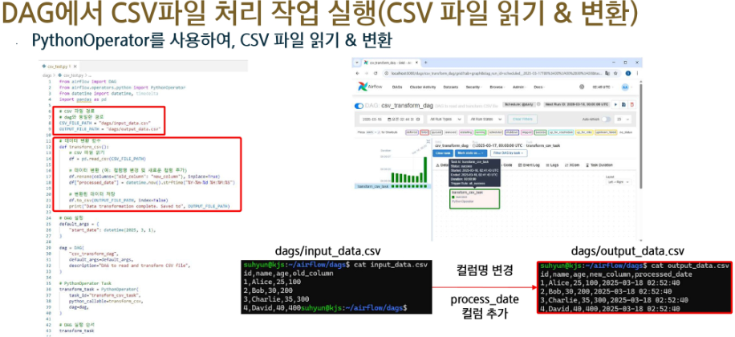
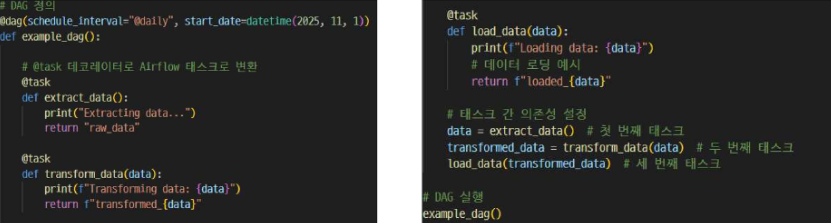
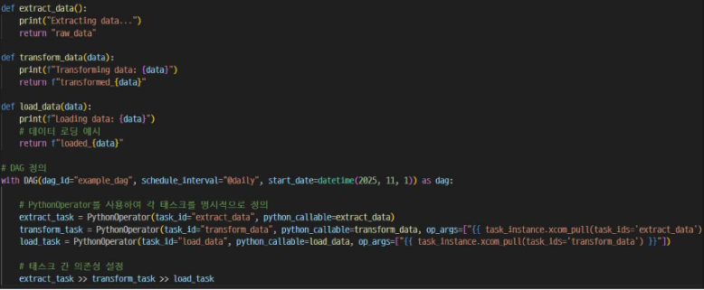

# 배치 처리 워크플로우 개요
- 배치 처리란?
  - 일정량의 데이터를 모아서 한꺼번에 처리하는 방식
  - 정해진 시간 또는 특정 이벤트 발생 시 실행
  - 대량 데이터를 처리하는데 적합하며, 주로 ETL 파이프라인, 데이터 웨어하우스 적재 등에 활용 

- 실시간 처리란?
  - 데이터가 발생하는 즉시 실시간으로 처리하는 방식
  - 지연 시간이 짧고, 스트리밍 데이터(실시간 로그, IoT 센서 데이터, ..)에 최적화
  - 주로 실시간 모니터링, 이상 탐지, 실시간 추천 시스템 등에 활용

  

- Apache Spark
  - 대규모 데이터를 빠르고 효율적으로 처리하는 분산 데이터 처리 프레임워크
  - In-Memory Computing(Hadoop보다 최대 100배 빠름)
  - 다양한 데이터 처리 방식 지원(RDD, DataFrame, Spark SQL)
  - Scalability(수십~수천 대의 클러스터 노드에서 병렬 실행 가능)
  - 배치 & 실시간 데이터 처리 모두 가능

- Apache Spark의 RDD 배치 처리 과정
  1. 데이터를 parallelize 또는 외부 소스에서 불러와 RDD를 생성
  2. Transformation 연산(map, filter 등)은 RDD를 새로 생성하지만 즉시 실행되지는 않음
  3. 여러 Transformation이 체이닝되어 실행 계획(DAG)을 구성
  4. Action 연산이 호출될 때 DAG가 실행되어 실제 데이터 처리가 수행

  

- Apache Spark의 DataFrame 배치 처리 과정
  1. 다양한 데이터 소스에서 read() 또는 laod()를 통해 DataFrame 생성
  2. 생성된 DataFrame에 select(), filter(), groupBy() 등의 Transformation 연산 적용
  3. 여러 단계의 Transformation이 체이닝되며, 새로운 DataFrame이 연속적으로 생성
  4. 마지막에 show(), count(), write()와 같은 Action이 호출되어 실제 실행이 이루어짐

  

- Apache Spark 배치 처리의 주요 활용 사례
  - 데이터 웨어하우스 적재(ETL)
    - Spark를 활용해 데이터를 정제 & 변환 후 데이터 웨어하우스에 저장
    - 예) 매일 수집한 CSV 데이터를 Parquet 변환 후 Snowflake, BigQuery 적재 
  - 로그 데이터 분석 
    - 웹사이트, 애플리케이션, 서버 로그 데이터를 분석하여 사용자 행동 분석
    - 예) 사용자의 클릭 로그를 분석하며 마케팅 전략 최적화 
  - 머신러닝 데이터 전처리
    - 대량의 데이터를 Spark에서 전처리하며 머신러닝 모델 학습에 사용
    - 예) 추천 시스템을 위한 사용자 행동 데이터 전처리 

- Airflow에서 Spark를 활용
  - 단순 Python 코드로 처리하기 어려운 대규모 데이터 처리
    - Pandas는 메모리에 로드할 수 있는 데이터 크기에 한계가 있음
    - 병렬 처리가 어려워 속도가 느림
    - 데이터를 여러 노드에서 나눠서 처리하는 기능이 없음
  - Spark를 활용하여 대량 데이터 ETL 수행
    - 단순 SQL이나 Python으로는 복잡한 ETL 작업을 수행하기 어려움
    - 대규모 데이터 변환이 필요한 경우, Spark의 강력한 데이터 처리 기능이 필요
  - Spark 작업을 모니터링하고 실패 시 자동 재시도할 수 있음
    - Spark 작업이 실패하면 Airflow에서 자동으로 감지하고 재시도 가능
    - Airflow Web UI에서 로그를 확인하고, 어떤 Task에서 문제가 발생했는지 쉽게 파악할 수 있음 
  
- 배치 워크플로우에서 DAG의 중요성
  - 자동화
    - 사람이 직접 실행할 필요 없이 정해진 스케줄에 따라 실행
  - 유지보수 용이
    - 실행 호드 및 실패 이력을 기록하여 문제 해결 가능
  - 확장성
    - 여러 작업을 DAG 내에서 관리하고, 병렬 실행 가능
  - 재시도 및 오류 감지
    - Task 실패 시 자동으로 재시도하여 안정적인 운영 가능 

# Airflow Decorator
- Python 함수 데코레이터로 태스크 정의
  - @task 데코레이터를 사용하여 Python 함수를 간단하게 Airflow 태스크로 변환
  - 코드의 가독성 향상 : 태스크 정의가 간결하고 직관적
  - DAG 정의 간소화 : DAG와 태스크 간의 관계를 쉽게 정의할 수 있음

- 주요 구성
  - @task: 함수 데코레이터, Python 함수가 Airflow 태스크로 변환
  - DAG 정의: DAG 매개변수로 태스크가 속할 DAG을 정의
  - 태스크 간 의존성 : 데코레이터를 사용하여 태스크 간 의존성 간단히 설정 가능

- 전통적인 방식
  - PythonOperator를 사용하여 각 태스크를 명시적으로 정의
  - Xcom을 사용하여 데이터를 전달하고 의존성 설정

  

- Python 함수 데코레이터로 태스크 정의

  

# SparkSubmitOperator
- Apache Airflow에서 Spark 애플리케이션을 실행하기 위한 전용 연산자
- Spark 클러스터에 .py, .jar, .scala 파일 등을 제출
