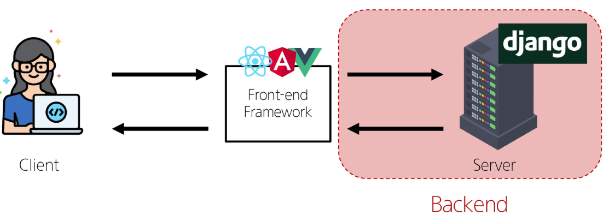
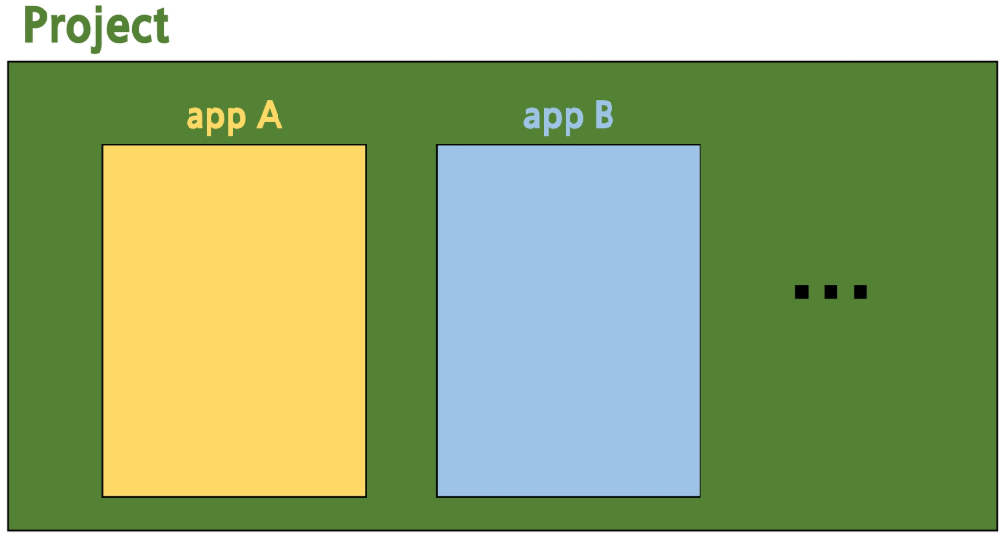
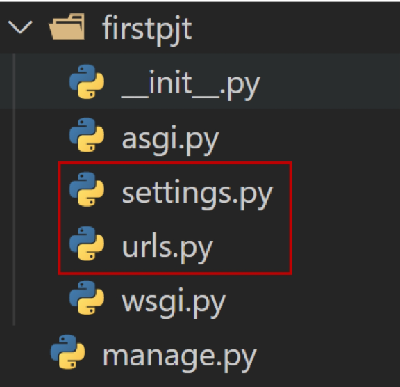
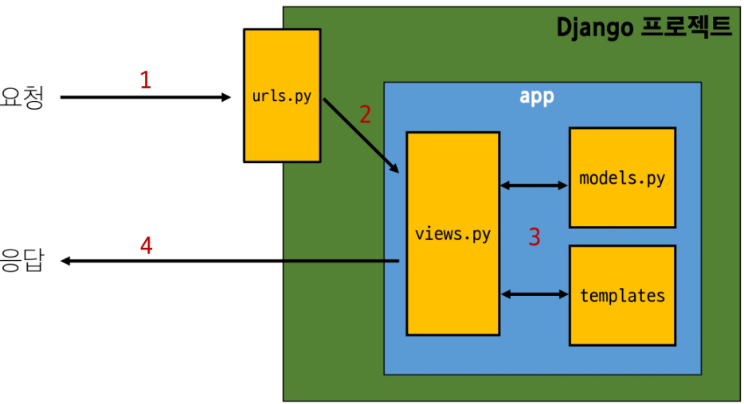
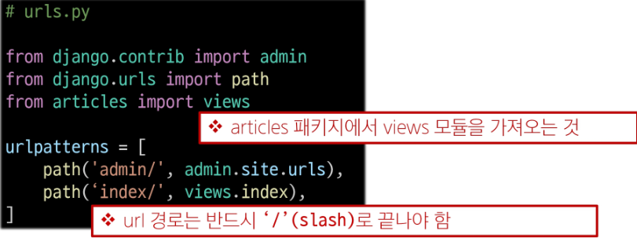
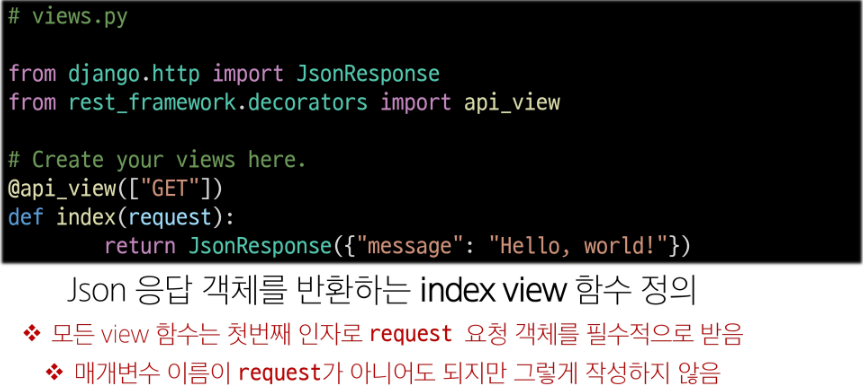
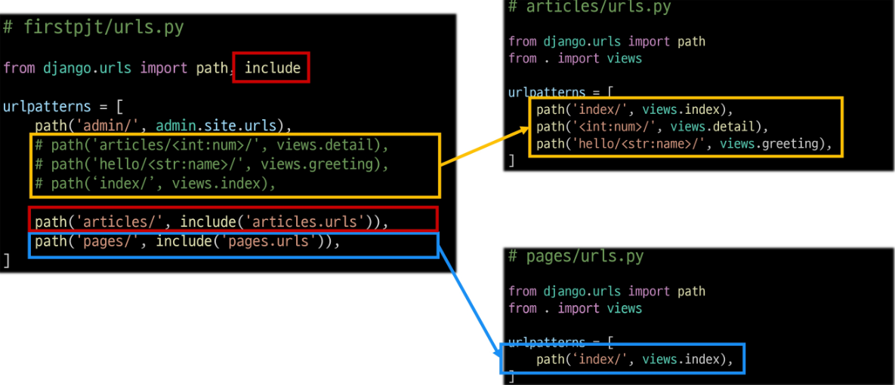

# Web Application
- 인터넷을 통해 사용자에게 제공되는 소프트웨어 프로그램을 구축하는 과정 
## Client & Server
- Client : 서비스를 **요청**하는 주체 
- Server : 클라이언트의 요청에 **응답**하는 주체


## Frontend & Backend
- Frontend : 사용자 인터페이스(UI)를 구성하고, 사용자가 애플리케이션과 상호작용할 수 있도록 함
  - 예) HTML, CSS, JavaScript, 프론트엔드 프레임워크, ...
- Backend : 서버 측에서 동작하며, 클라이언트의 요청에 대한 처리와 데이터베이스와의 상호작용 등을 담당 
  - 예) 서버 언어(Python, Java 등) 및 백엔드 프레임워크, 데이터베이스, API, 보안, ...



---
# Django Framework
- Web Framework : 웹 애플리케이션을 빠르게 개발할 수 있도록 도와주는 도구(개발에 필요한 기본 구조, 규칙, 라이브러리 등을 제공)
- Django : **Python** 기반의 대표적인 웹 프레임워크 
## 가상환경
- Python 애플리케이션과 그에 따른 패키지들을 격리하여 관리할 수 있는 **독립적인** 실행 환경


```
$ python -m venv venv # 가상환경 생성
$ source venv/Scripts/activate # 가상환경 활성화
$ pip freeze > requirements.txt # 의존성 패키지 목록 생성
$ pip install -r requirements.txt # 패키지 목록 기반 설치

$ django-admin startproject projectname . # projectname이라는 이름의 Django 프로젝트 생성
$ python manage.py runserver # Django 서버 실행
# http://127.0.1:8000/ 접속 후 확인
```

## Django Design Pattern
- MTV(Model, Template, View) 디자인 패턴 : Django에서 애플리케이션을 구조화하는 패턴 

## Django Project & App

- Django project : 애플리케이션의 집합(DB설정, URL연결, 전체 앱 설정 등을 처리)
- Django application : 독립적으로 작동하는 기능 단위 모듈 
  - 예) 온라인 커뮤니티 카페 - 프로젝트:카페, 앱:게시글, 댓글, 회원 관리, ...
```
$ python manage.py startapp appname # appname이라는 앱 생성(생성 후, settings.py 내에 INSTALLED_APPS에 appname 등록 필수)
```
- 프로젝트 구조


  - settings.py : 프로젝트의 모든 설정을 관리
  - urls.py : 요청 들어오는 URL에 따라 이에 해당하는 적절한 views를 연결
- 앱 구조


  - admin.py : 관리자용 페이지 설정
  - models.py : DB와 관련된 Model을 정의
  - views.py : HTTP 요청을 처리하고 해당 요청에 대한 응답을 반환 
---

# REST API
- API: 두 소프트웨어가 서로 통신할 수 있게 하는 메커니즘('클라이언드-서버'처럼 서로 다른 프로그램에서 요청과 응답을 받을 수 있도록 만든 체계)

- REST : API Server를 개발하기 위한 일종의 소프트웨어 설계 방법론 
- REST API : REST라는 설계 디자인 약속을 지켜 구현한 API

- REST에서 자원을 사용하는 법 3가지 -> 식별, 행위, 표현 

## 자원의 식별
- URI : 인터넷에서 리소스(자원)을 식별하는 문자열
  - 가장 일반적인 URI는 웹 주소로 알려진 URL
  - URL : 웹에서 주어진 리소스의 주소 

## 자원의 행위
- HTTP Request Methods : 리소스에 대한 행위를 정의
  - GET: 서버에 리소스의 표현을 요청(검색)
  - POST: 데이터를 지정된 리소스에 제출
  - PUT: 요청한 주소의 리소스를 수정
  - DELETE: 지정된 리소스를 삭제 

## 자원의 표현
- Django는 Full Stack Framework에 속하기 때문에 기본적으로 사용자에게 페이지(html)을 응답한다. 
- REST API는 JSON 타입으로 응답하는 것을 권장 


# 요청과 응답
- Django REST Framework : Django에서 Restful API 서버를 쉽게 구축할 수 있도록 도와주는 오픈소스 라이브러리 
  - 사전에 가상환경 설정하기
  

1. URLs
  
  

  - http://127.0.0.1:8000/index/ 로 요청이 왔을 때 views 모듈의 view 함수 index를 호출 
2. View

  


## 변수와 URL
- Variable Routing: URL 일부에 변수를 포함시키는 것(변수는 view 함수의 인자로 전달할 수 있음) 
- 예시
  - urls.py
    - `urlpatterns = [path('articles/<int:num>/', views.detail)]`
  - views.py
    - ```
      @api_view(["GET"])
      def detail(request, num):
        context = {
          'num': num,
        }
        return JsonResponse(context)
      ```


## APP과 URL 
- App URL mapping : 각 앱에 URL을 정의하는 것 -> 프로젝트와 각 앱이 URL을 나누어 관리를 편하게 하기 위함 => URL을 각자 app에서 관리하자 

  

