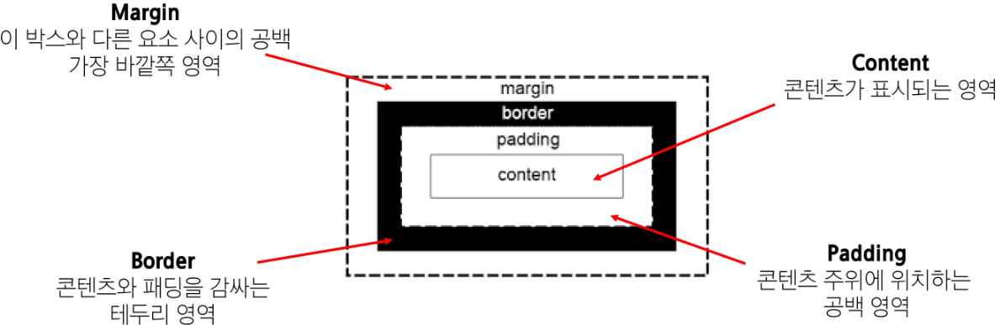
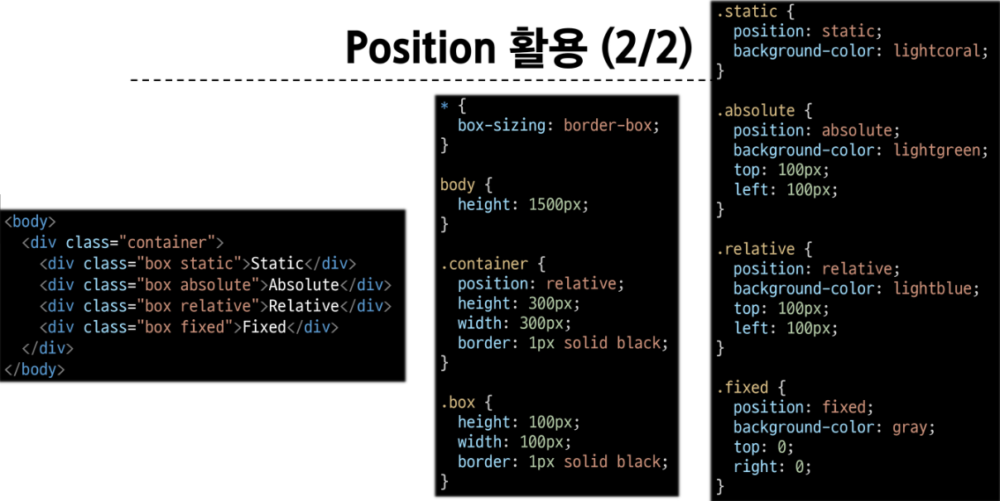
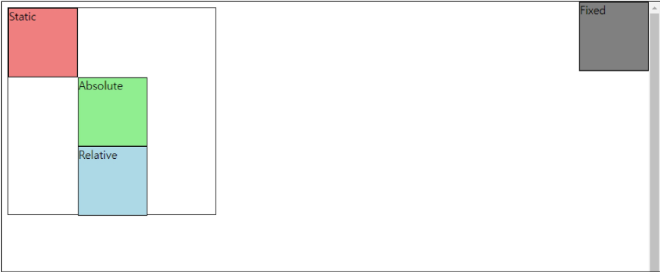
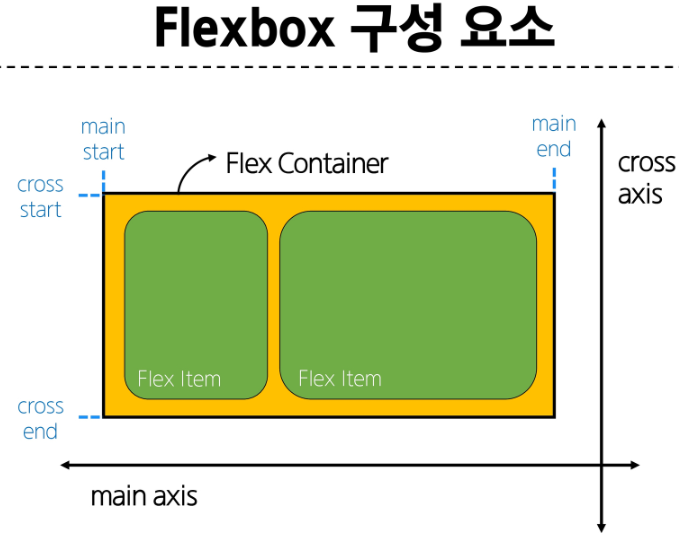
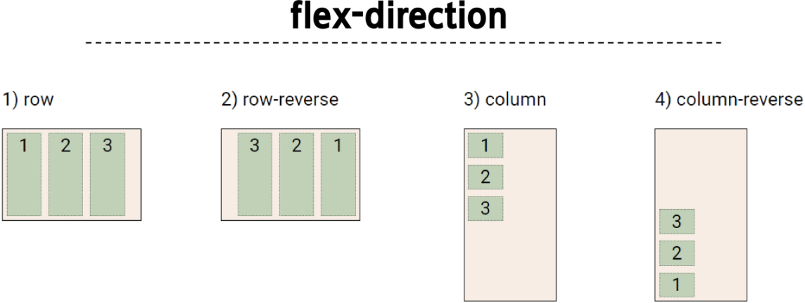
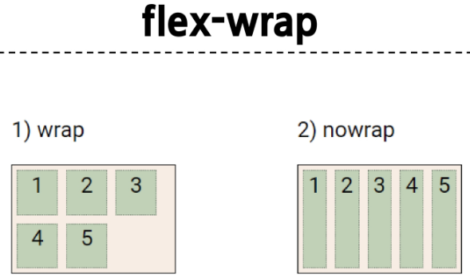
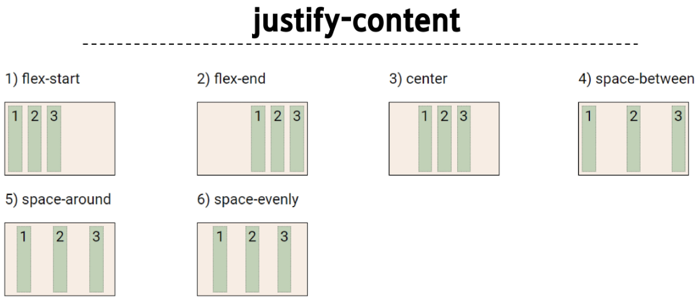
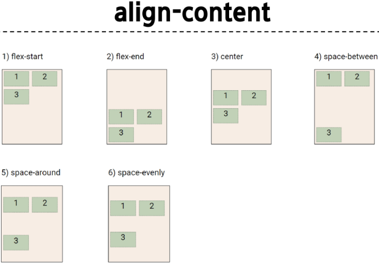
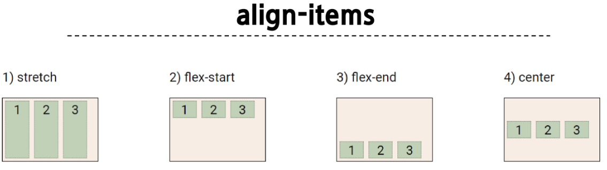
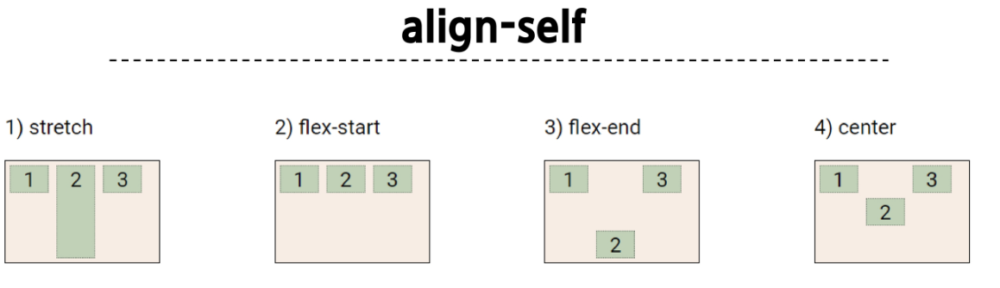

# CSS Box Model
- CSS Box Model : 웹 페이지의 모든 HTML 요소를 감싸는 사각형 상자 모델 

- Box 구성 요소

  

- shorthand 속성
  - `border: 2px solid black;` -> border-width, border-style, border-color를 한번에 설정
  - `margin: 10px 20px 30px 40px;`
  - `padding: 10px 20px 30px 40px;`

- box-sizing 속성
  - width와 height 속성 값 조정은 실제 박스 전체가 아닌, padding 내의 content box의 크기를 조정하는 것 
  - but,
    ```
    * {
      box-sizing: border-box;
    }
    ```
    -> 전체 박스 크기 기준으로 width와 height 조정

- 기타 display 속성
  1. inline-block
    - inline과 block 요소 사이의 중간 지점을 제공하는 display 값
    - width 및 height 속성 사용 가능
    - padding, margin 및 border로 인해 다른 요소가 **상자에서 밀려남**
    - **새로운 행으로 넘어가지 않음** 
    - => 요소가 줄바꿈 되는 것을 원하지 않으면서 너비와 높이를 적용하고 싶은 경우에 사용 
    - `display: inline-block;`
  2. none
    - 요소를 화면에 표시하지 않고, 공간조차 부여되지 않음 


# CSS Position
- CSS Layout : 각 요소의 **위치와 크기를 조정**하여 웹 페이지의 디자인을 결정하는 것(Display, Position, Flexbox, ..)
- CSS Position: 요소를 Normal Flow에서 제거하여 다른 위치로 배치하는 것 
- 포지션 유형
  1. static
  2. relative
  3. absolute
  4. fixed
  5. sticky 

  | 코드 | 결과 |
  |--------|---------|
  ||

- z-index
  - 요소의 쌓임 순서를 정의하는 속성 
  - 값이 클수록 요소가 위에 쌓이게 됨 
  - 부모 요소의 z-index 값에 영향을 받음
  - 같은 부모 내에서만 z-index 값을 비교

# CSS Flexbox
- CSS Flexbox: 요소를 행과 열 형태로 배치하는 1차원 레이아웃 방식 
- ```
  .container {
    display: flex;
  }
  ```



- Flexbox 속성 목록
  - Flex Container 관련 속성
    - display, flex-direction, flex-wrap, justify-content, align_items, align-content
  - Flex Item 관련 속성
    - align-self, flex-grow, flex-basis, order 

  

  

  

  

  

  

