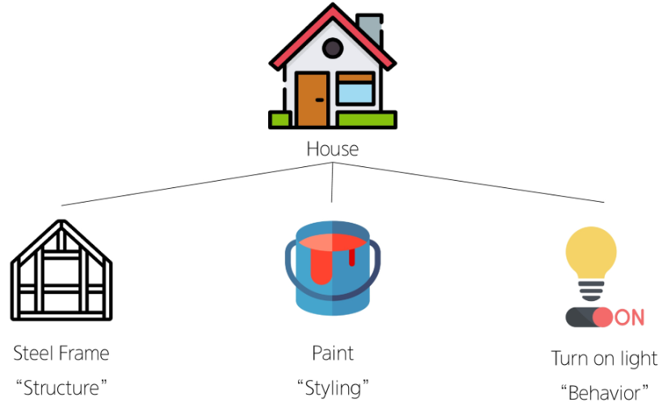
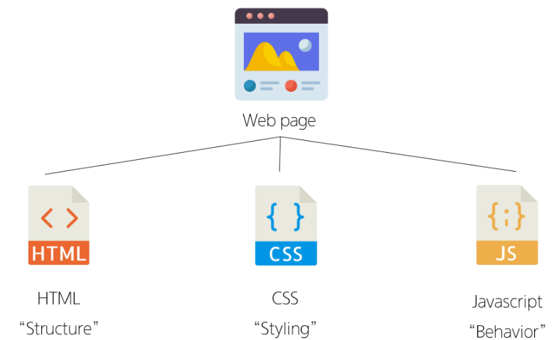
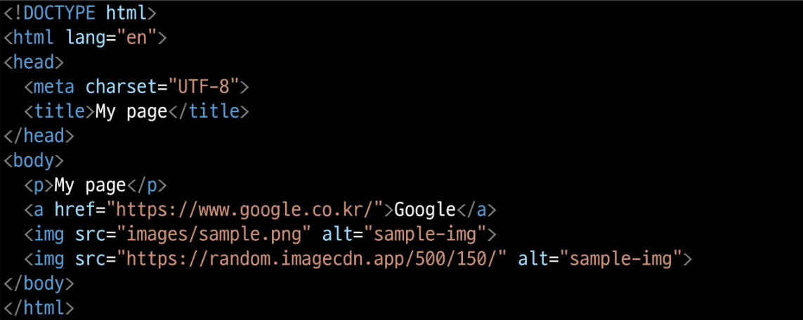
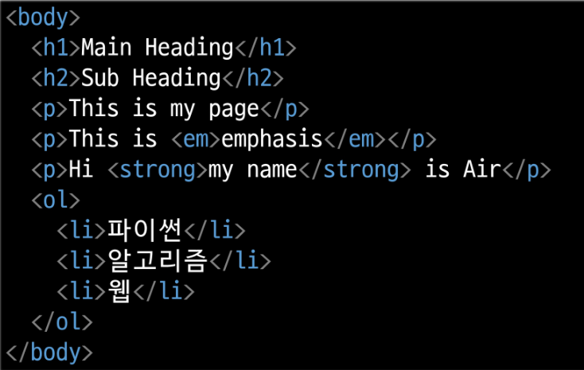
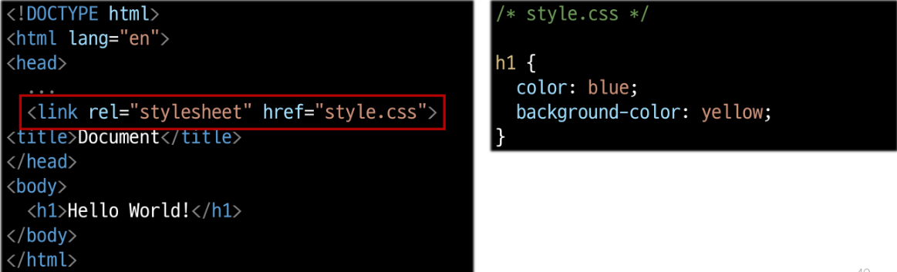
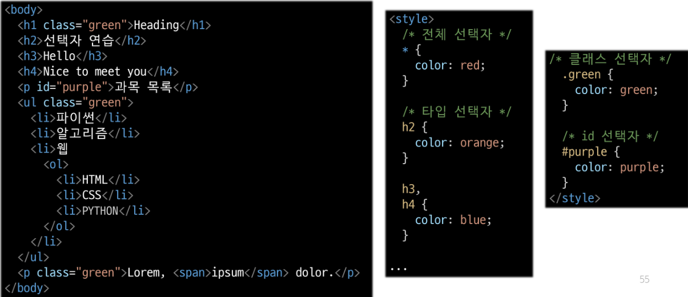
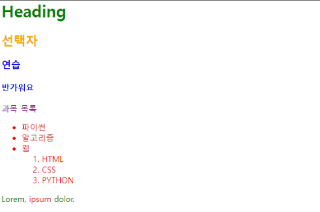
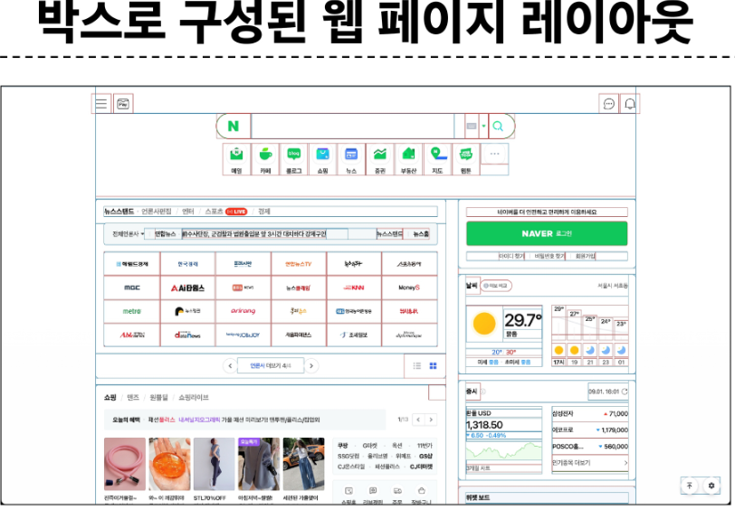
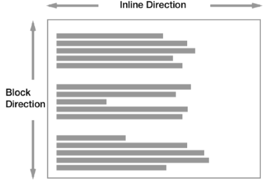

# 웹
- 웹
  - Web site, Web application 등을 통해 사용자들이 정보를 검색하고 상호 작용하는 기술


- 웹 페이지 구성 요소

  

  


# 웹 구조화
- HTML(HyperText Markup Language)
  - 웹 페이지의 의미와 구조를 정의하는 언어

- Markup Language 예시
  ```
  <h1>HTML</h1>
  <p> 문단 </p>

  <h2>Hyper Text.</h2>

  <p>문단2</p> 
  ```

- HTML 구조 예시

  
  
- 대표적인 HTML Text structure
  - Heading & Paragraphs
    - h1~h6
  - Lists
    - ol, ul, li
  - Emphasis & Importance
    - em, strong 
  
  

# 웹 스타일링  

- CSS
  - 웹 페이지의 디자인과 레이아웃을 구성하는 언어 
  ```
  h1 {
    color: red;
    font-size: 30px;
  }
  ```

- CSS 적용 방법
  - 인라인 스타일
    - HTML **요소 안에** style 속성 값으로 작성
    - `<h1 style="color: blue; background-color: yellow;">Hello World!</h1>`
  
  - 내부 스타일 시트
    - **head 태그 안에 style 태그에** 작성
    ```
    <style>
      h1 {
        color: blue;
        background-color: yellow;
      }
    </style>
    ```

  - 외부 스타일 시트
    - 별도의 CSS 파일 생성 후 HTML link 태그를 사용해 불러오기

    

  - CSS Selectors
    - HTML 요소를 선택하여 스타일을 적용할 수 있도록 하는 선택자 
      - 전체 선택자: *
      - 요소 선택자: 지정한 모든 태그를 선택
      - 클래스 선택자: .
      - 아이디 선택자: # 
  
    | 코드 | 결과 |
    |--------|---------|
    ||

    - 자손 결합자: " "(space)
      - p span은 <p> 안에 있는 모든 <span>을 선택
    - 자식 결합자: >
      - 첫 번째 요소의 **직계 자식만 모두** 선택
    
- 명시도(Specificity)    
  - 결과적으로 요소에 적용할 CSS 선언을 결정하기 위한 Selector의 가중치 계산 알고리즘
  - 동일한 요소를 가리키는 2개 이상의 CSS 규칙이 있는 경우 높은 명시도의 스타일이 적용됨

  - 명시도가 높은 순
    1. Importance(`!importance`)
    2. Inline 스타일
    3. 선택자(id 선택자 > class 선택자 > 요소 선택자)
    4. 소스 코드 선언 순서 
  
- CSS 상속
  - 기본적으로 CSS는 상속을 통해 **부모 요소의 속성을 자식에게 상속**해 재사용성을 높임
  - 상속 되는 속성
    - Text 관련 요소(font, color, text-align), opacity, ...
  - 상속 되지 않는 속성
    - Box model 관련 요소(width, height, border, ..)
    - position 관련 요소(position, top/right/bottom/left, ...)

- CSS Box Model
  - 웹 페이지의 모든 HTML 요소를 감싸는 사각형 상자 모델 
  

  - 박스 표시 타입
    1. Outer display type
      - block
        - **항상 새로운 행으로 나뉨**
        - width와 height 속성 사용 가능
        - padding, margin, border로 인해 **다른 요소를 상자로부터 밀어냄**
        - width 속성 지정하지 않으면 inline 방향으로 사용 가능한 공간 모두 차지
        - h1~h6, p, div
      - Inline
        - **새로운 행으로 넘어가지 않음**
        - width와 height 속성 사용 불가
        - 수직 방향 : 밀어낼 수 없음
        - 수평 방향 : 밀어낼 수 있음
        - a, img, span, strong, em 

      
      
    2. Inner display type
      - 박스 내부의 요소들이 어떻게 배치될지를 결정 

